

    <h1>Awesome Spatial Intelligence in LLM/VLM</h1>
    
    

This is a collection of research papers about Spatial Intelligence in LLM or VLM.

If you would like to include your paper or update any details (e.g., code urls, conference information), please feel free to submit a pull request or email me. Any advice is also welcome.

## Table of Contents
- [Awesome-Spatial-Reasoning](#Awesome-Spatial-Reasoning)
  - [Overview](#Overview-of-Embodied-Multimodal-LLMs)
  - [Methods](#Methods)
  - [Datasets & Benchmark](#Datasets-&-Benchmark)
  - [Applications](#Applications)

## Overview

Spatial thinking is the foundation of abstract thought. Human uses spatial thinking everywhere (math, 
social network, flow chart, mind map). It's also important for LLM or VLM to build spatial cognition ability to perceive and interact with surroundings. We evaluate spatial ability based on text, single or multi-view images, 3d image or video as input. We enhance spatial ability with visual prompt, text input, image input or image input with 3D.

## Methods
### Visual based
| Title                                                        |                        Introduction                         |    Date    |                             Code                             |
| :----------------------------------------------------------- | :---------------------------------------------------------: | :--------: | :----------------------------------------------------------: |
|  [SpatialCoT: Advancing Spatial Reasoning through Coordinate Alignment and Chain-of-Thought for Embodied Task Planning](https://arxiv.org/abs/2501.10074) |   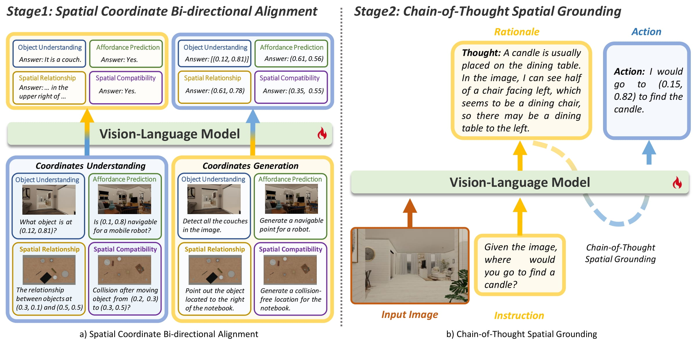   | 2025-01 |         [Github](https://spatialcot.github.io/)         |
|   [Sparkle: Mastering Basic Spatial Capabilities in Vision Language Models Elicits Generalization to Composite Spatial Reasoning](https://arxiv.org/abs/2410.16162) |      | 2024-10 |     -     |
|   [SpatialRGPT: Grounded Spatial Reasoning in Vision Language Models](https://arxiv.org/abs/2406.01584) |   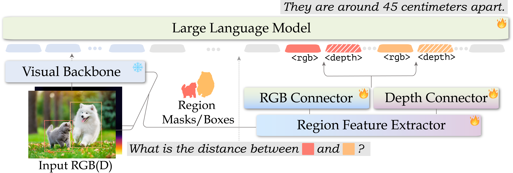   | 2024-06 |         [Github](https://github.com/AnjieCheng/SpatialRGPT)         |
 [SpatialBot: Precise Spatial Understanding with Vision Language Models](https://arxiv.org/abs/2406.13642) |   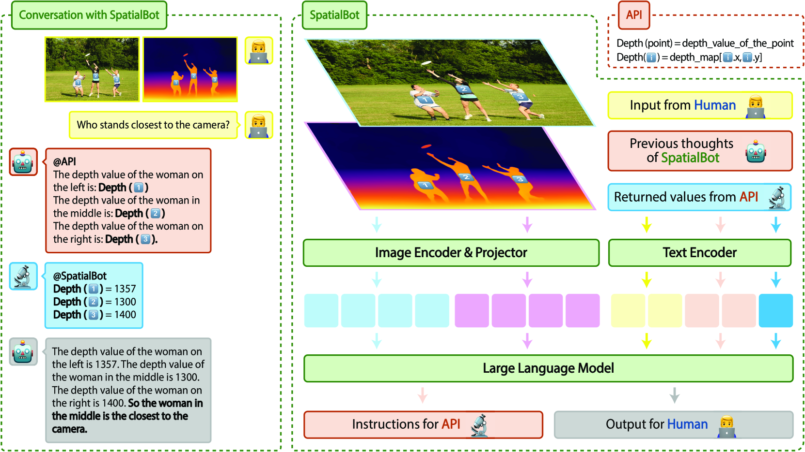   | 2024-06 |         [Github](https://github.com/BAAI-DCAI/SpatialBot)         |
|   [Learning to Localize Objects Improves Spatial Reasoning in Visual-LLMs](https://arxiv.org/abs/2404.07449) |   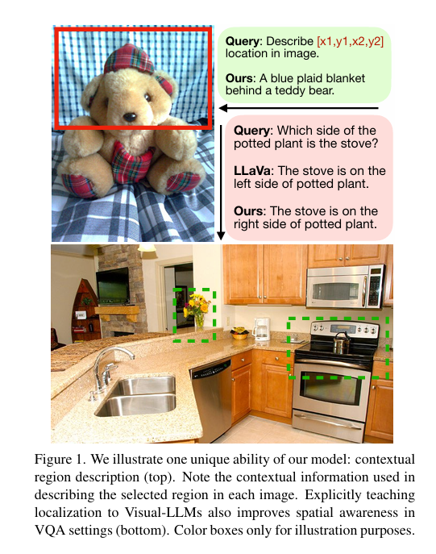   | 2024-04 |         [Github](https://github.com/kahnchana/locvlm)         |
|   [Can Transformers Capture Spatial Relations between Objects?](https://arxiv.org/abs/2403.00729) |      | 2024-03 |         [Github](https://github.com/AlvinWen428/spatial-relation-benchmark)         |
|   [SpatialVLM: Endowing Vision-Language Models with Spatial Reasoning Capabilities](https://arxiv.org/abs/2401.12168) |      | 2024-01 |         [Github](https://github.com/remyxai/VQASynth)         |
|   [Proximity QA: Unleashing the Power of Multi-Modal Large Language Models for Spatial Proximity Analysis](https://arxiv.org/abs/2401.17862) |   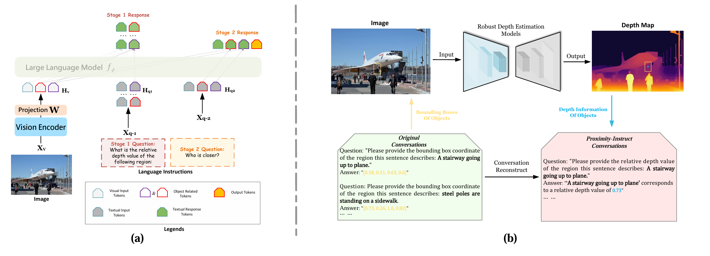   | 2024-01 |         [Github](https://github.com/NorthSummer/ProximityQA)         |
|  [3DAxiesPrompts: Unleashing the 3D Spatial Task Capabilities of GPT-4V](https://arxiv.org/abs//2312.09738) |   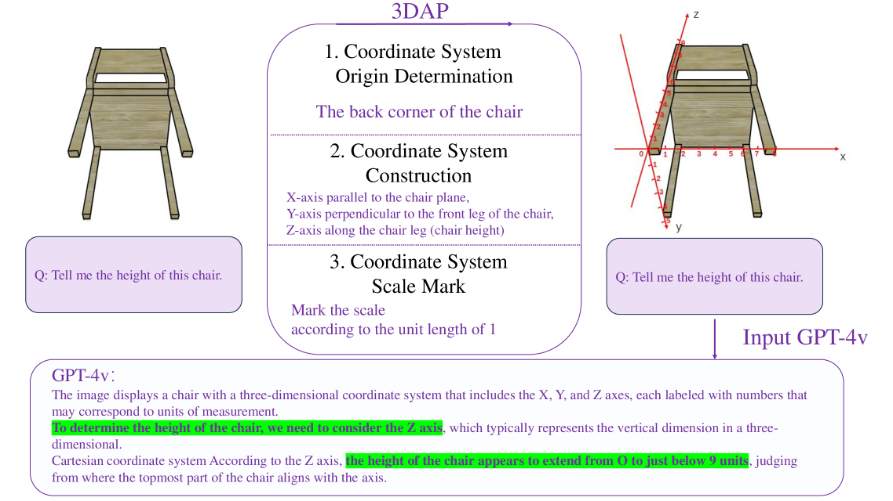   | 2023-12 |    -   |

### Text based
| Title                                                        |                        Introduction                         |    Date    |                             Code                             |
| :----------------------------------------------------------- | :---------------------------------------------------------: | :--------: | :----------------------------------------------------------: |
|  [Imagine while Reasoning in Space: Multimodal Visualization-of-Thought](https://arxiv.org/abs/2501.07542) |      | 2025-01 |   -       |
|  [Dspy-based Neural-Symbolic Pipeline to Enhance Spatial Reasoning in LLMs](https://arxiv.org/abs/2411.18564) |   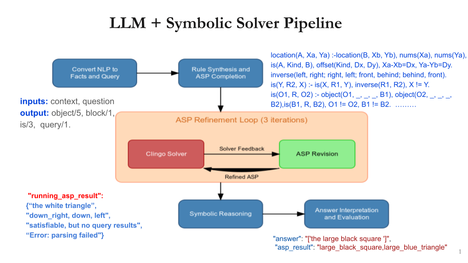   | 2024-11 |       -       |
|   [SpaRC and SpaRP: Spatial Reasoning Characterization and Path Generation for Understanding Spatial Reasoning Capability of Large Language Models](https://arxiv.org/abs/2406.04566) |   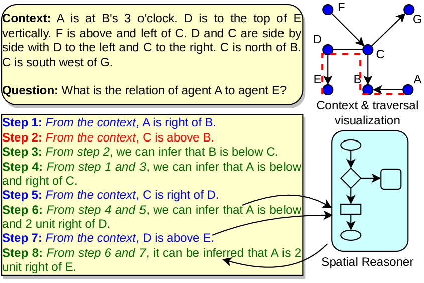   | 2024-06 |         [Github](https://github.com/UKPLab/acl2024-sparc-and-sparp)         |
|   [Beyond Lines and Circles: Unveiling the Geometric Reasoning Gap in Large Language Models](https://arxiv.org/abs/2402.03877) |   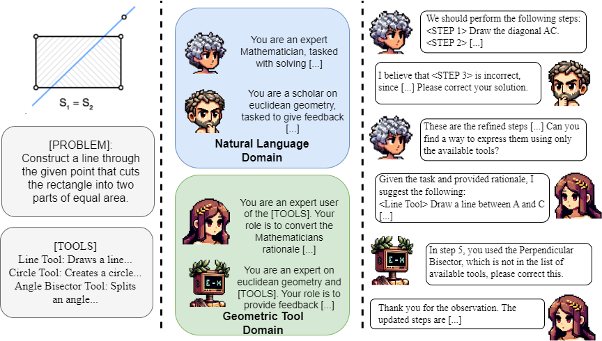   | 2024-02 |       -       |
|   [Advancing Spatial Reasoning in Large Language Models: An In-Depth Evaluation and Enhancement Using the StepGame Benchmark](https://arxiv.org/abs/2401.03991) |   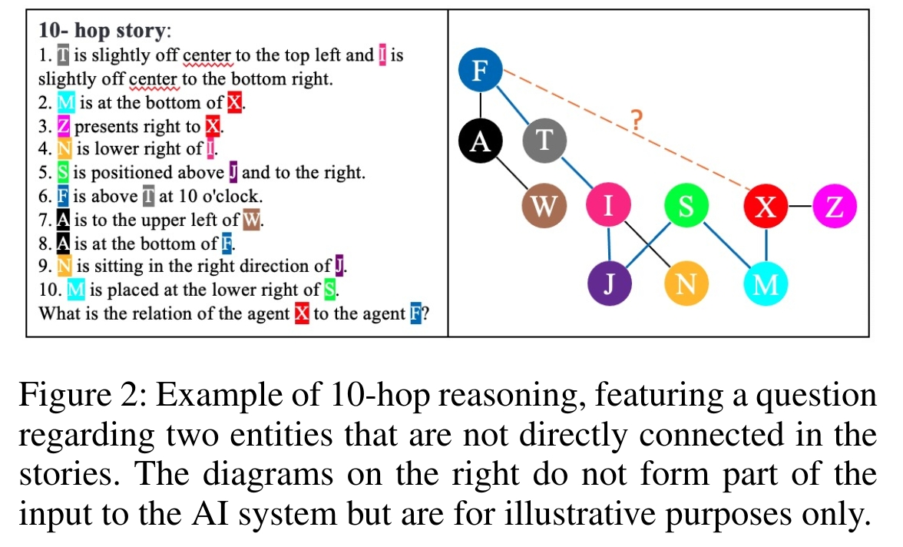   | 2024-01 |      [Github](https://github.com/Fangjun-Li/SpatialLM-StepGame)    |
## Datasets & Benchmark
### Visual based
| Title                                                        |                         Introduction                         |    Date    |                           Code                           |
| :----------------------------------------------------------- | :----------------------------------------------------------: | :--------: | :------------------------------------------------------: |
|   [iVISPAR — An Interactive Visual-Spatial Reasoning Benchmark for VLMs](https://arxiv.org/abs/2502.03214) |      | 2025-02 |             [Github](https://github.com/SharkyBamboozle/iVISPAR)          |
|   [SAT: Spatial Aptitude Training for Multimodal Language Models](https://arxiv.org/abs/2412.07755) |   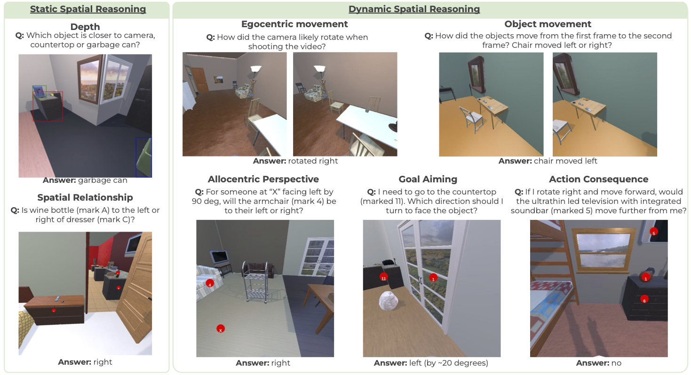   | 2024-12 |             [Github](https://arijitray1993.github.io/SAT/)          |
|  [SPHERE: A Hierarchical Evaluation on Spatial Perception and Reasoning for Vision-Language Models](https://arxiv.org/abs/2412.12693) |   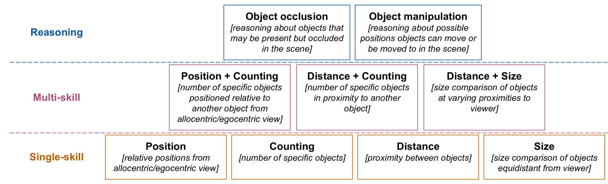   | 2024-12 |             [Github](https://github.com/Fangjun-Li/RoomSpace)          |
|   [3DSRBench: A Comprehensive 3D Spatial Reasoning Benchmark](https://arxiv.org/abs/2412.07825) |      | 2024-12 |             [Github](https://3dsrbench.github.io/)          |
|   [Thinking in Space: How Multimodal Large Language Models See, Remember and Recall Spaces](https://arxiv.org/abs/2412.14171) |      | 2024-12 |             [Github](https://github.com/vision-x-nyu/thinking-in-space)          |
|   [RoboSpatial: Teaching Spatial Understanding to 2D and 3D Vision-Language Models for Robotics](https://arxiv.org/abs/2411.16537) |      | 2024-11 |         -   |
|   [An Empirical Analysis on Spatial Reasoning Capabilities of Large Multimodal Models](https://arxiv.org/abs/2411.06048) |      | 2024-11 |  -     |
|   [Do Vision-Language Models Represent Space and How? Evaluating Spatial Frame of Reference Under Ambiguities](https://arxiv.org/abs/2410.17385) |   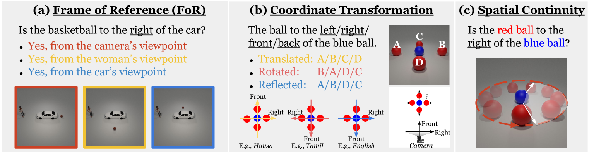   | 2024-10 |             [Github](https://github.com/sled-group/COMFORT)          | 
|   [R2D3:ImpartingSpatial Reasoning by Reconstructing 3D Scenes from 2D Images](https://openreview.net/pdf?id=Ku4lylDpjq) |      | 2024-10 |             [Github](https://github.com/arijitray1993/r2d3/)          | 
|   [Reasoning Paths with Reference Objects Elicit Quantitative Spatial Reasoning in Large Vision-Language Models](https://arxiv.org/abs/2409.09788) |      | 2024-09 |             [Github](https://github.com/andrewliao11/Q-Spatial-Bench-code)          |          -     |
|   [Can Vision Language Models Learn from Visual Demonstrations of Ambiguous Spatial Reasoning?](https://arxiv.org/abs/2409.17080) |   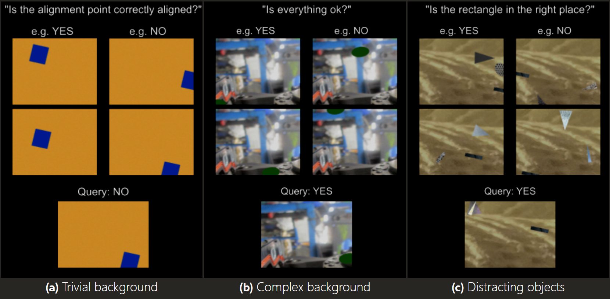   | 2024-09 |       -     |
|   [EmbSpatial-Bench: Benchmarking Spatial Understanding for Embodied Tasks with Large Vision-Language Models](https://arxiv.org/abs/2406.05756) |      | 2024-06 |             [Github](https://github.com/mengfeidu/EmbSpatial-Bench)          |
|   [TopViewRS: Vision-Language Models as Top-View Spatial Reasoners](https://arxiv.org/abs/2406.05756) |      | 2024-06 |             [Github](https://github.com/cambridgeltl/topviewrs)          |
|   [Is A Picture Worth A Thousand Words? Delving Into Spatial Reasoning for Vision Language Models](https://arxiv.org/abs/2406.14852) |      | 2024-06 |      [Github](https://github.com/jiayuww/SpatialEval)      |     -  |
|   [GSR-Bench: A Benchmark for Grounded Spatial Reasoning Evaluation via Multimodal LLMs](https://arxiv.org/abs/2406.13246) |   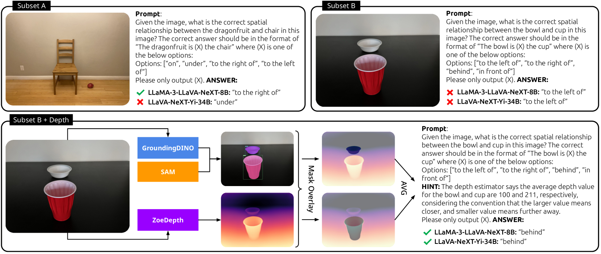   | 2024-06 |             -      |
|   [Reframing Spatial Reasoning Evaluation in Language Models: A Real-World Simulation Benchmark for Qualitative Reasoning](https://arxiv.org/abs/2405.15064) |   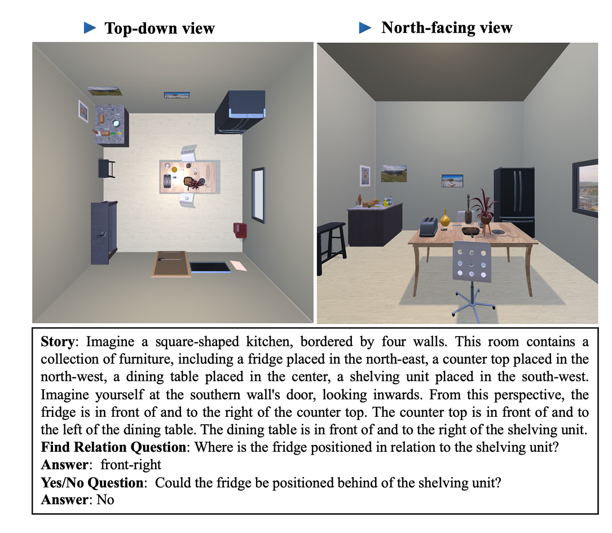   | 2024-05 |             [Github](https://github.com/Fangjun-Li/RoomSpace)          |
|    [Things not Written in Text: Exploring Spatial Commonsense from Visual Signals](https://arxiv.org/abs/2203.08075) |   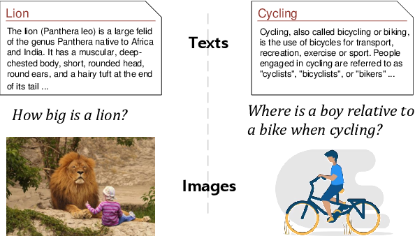   | 2022-03 |   [Github](https://github.com/xxxiaol/spatial-commonsense)
|   [SPARE3D: ADataset for SPAtial REasoning on Three-View Line Drawings](https://arxiv.org/abs/2003.14034) |      | 2020-03 |             [Github](https://github.com/ai4ce/spare3d)          |
### Text based
| Title                                                        |                         Introduction                         |    Date    |                           Code                           |
| :----------------------------------------------------------- | :----------------------------------------------------------: | :--------: | :------------------------------------------------------: |
|   [Do Multimodal Language Models Really Understand Direction? A Benchmark for Compass Direction Reasoning](https://arxiv.org/abs/2412.16599) |   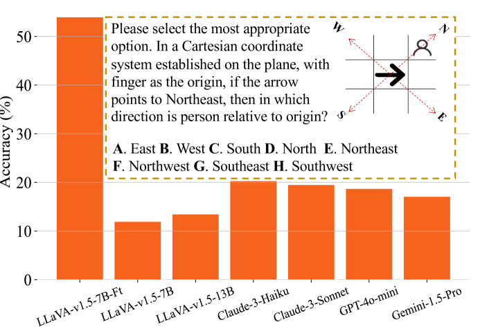   | 2024-12 |      -
|   [GRASP: A Grid-Based Benchmark for Evaluating Commonsense Spatial Reasoning](https://arxiv.org/abs/2407.01892) |   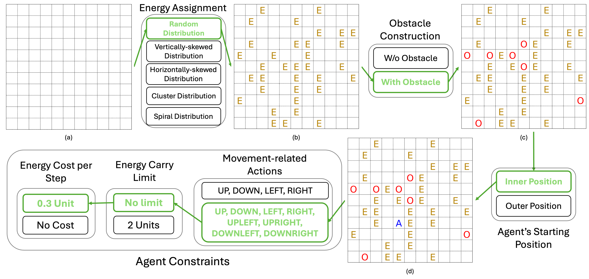   | 2024-07 |  -   |

## Applications
| Title                                                        |                         Introduction                         |    Date    |                           Code                           |
| :----------------------------------------------------------- | :----------------------------------------------------------: | :--------: | :------------------------------------------------------: |
|   [Improving Vision-and-Language Reasoning via Spatial Relations Modeling](https://arxiv.org/abs/2311.05298) |   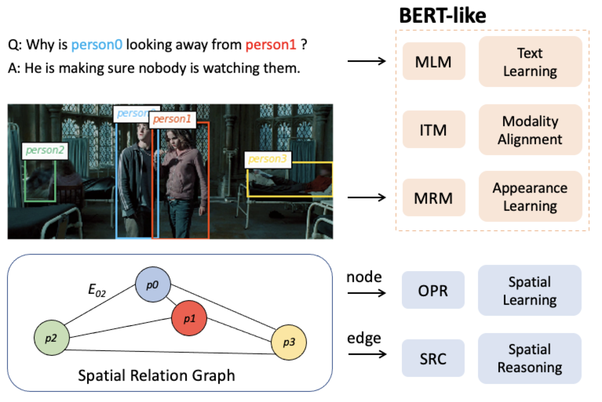   | 2023-11 |    -     |
|   [Know Your Neighbors: Improving Single-View Reconstruction via Spatial Vision-Language Reasoning](https://arxiv.org/abs/2404.03658) |   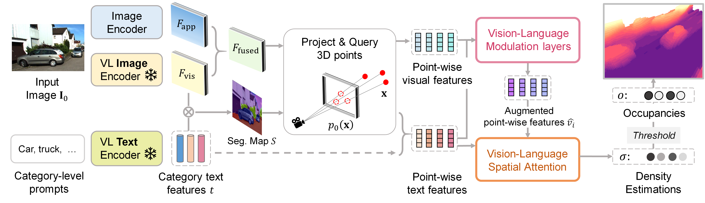   | 2024-04 |     [Github](https://github.com/ruili3/Know-Your-Neighbors)     |
|   [VL-Nav: Real-time Vision-Language Navigation with Spatial Reasoning](https://arxiv.org/abs/2502.0093) |   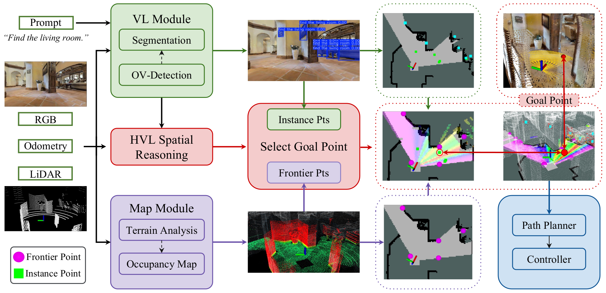   | 2025-02 |     -  |
|   [EMMA-X:AnEmbodied Multimodal Action Model with Grounded Chain of Thought and Look-ahead Spatial Reasoning](https://arxiv.org/abs/2412.11974) |   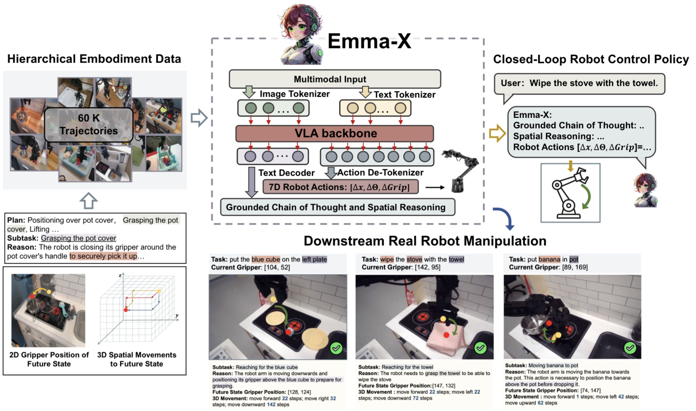   | 2024-12 |     (https://github.com/declare-lab/Emma-X)  |
|   [SpatialVLA: Exploring Spatial Representations for Visual-Language-Action Models](https://arxiv.org/abs/2501.15830) |   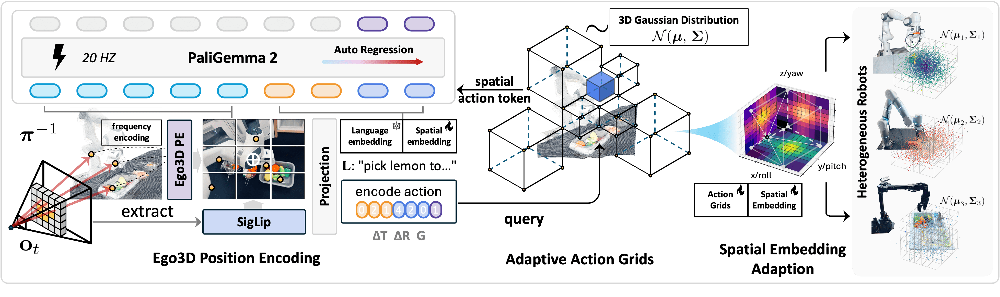   | 2025-01 |     (https://github.com/SpatialVLA/SpatialVLA)  |

