

    <h1>Awesome Spatial Intelligence in VLM</h1>
    
    

This is a carefully curated and maintained list of resources, bringing together key methods, datasets and benchmarks in the field of Spatial Intelligence in VLM .

Spatial reasoning is a core capability for achieving Artificial General Intelligence (AGI) and Physical Intelligence. It requires models to not only "see" objects but to also understand their positions, relationships, geometry, and dynamic changes within the 3D world.

With the development of multi-modal models, evaluating and enhancing their spatial intelligence has become a key research frontier. This list aims to provide researchers and engineers with a quick index to track the latest advancements in the field.

We welcome contributions of excellent resources you find via Pull Request!

## Table of Contents
- [Awesome Spatial Intelligence in VLM](#Awesome Spatial Intelligence in VLM)
  <!-- - [Overview](#Overview-of-Embodied-Multimodal-LLMs) -->
  - [Methods](#Methods)
  - [Datasets & Benchmark](#Datasets-&-Benchmark)
  - [Applications](#Applications)

<!-- ## Overview

Spatial thinking is the foundation of abstract thought. Human uses spatial thinking everywhere (math, 
social network, flow chart, mind map). It's also important for LLM or VLM to build spatial cognition ability to perceive and interact with surroundings. We evaluate spatial ability based on text, single or multi-view images, 3d image or video as input. We enhance spatial ability with visual prompt, text input, image input or image input with 3D. -->

## Methods
### Visual based
| Title                                                        |                        Introduction                         |    Date    |                             Code                             |
| :----------------------------------------------------------- | :---------------------------------------------------------: | :--------: | :----------------------------------------------------------: 
|  [Thinking with Camera: A Unified Multimodal Model for Camera-Centric Understanding and Generation](https://arxiv.org/abs/2510.08673) | 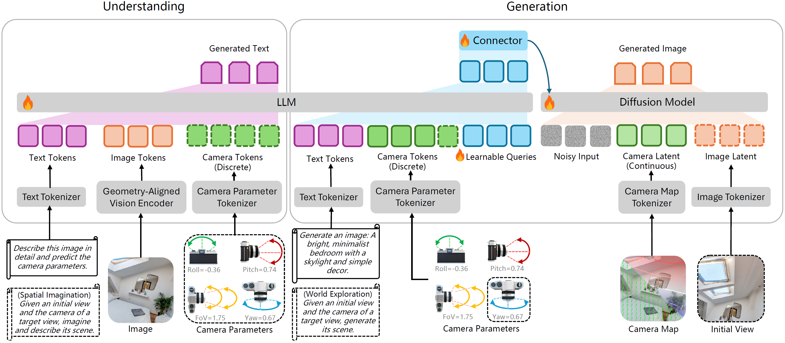 | 2025-10 | [Github](https://kangliao929.github.io/projects/puffin/) |
|  [Think with 3D: Geometric Imagination Grounded Spatial Reasoning from Limited Views](https://arxiv.org/html/2510.18632) | 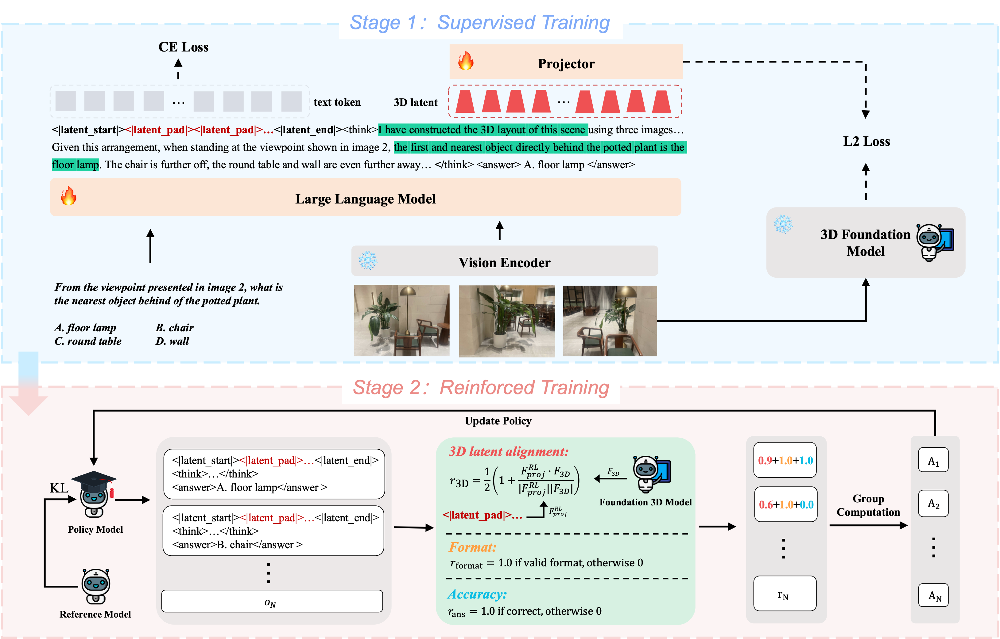 | 2025-10 | [Github](https://github.com/zhangquanchen/3DThinker) |
|  [Euclid’s Gift: Enhancing Spatial Perception and Reasoning in Vision-Language Models via Geometric Surrogate Tasks](https://arxiv.org/abs/2509.24473) |  | 2025-10 | [Github](https://github.com/LiamLian0727/Euclids_Gift) |
|  [SpatialLadder: Progressive Training for Spatial Reasoning in Vision-Language Models](https://arxiv.org/abs/2510.08531) | 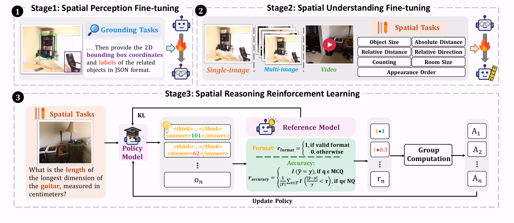 | 2025-08 | [Github](https://zju-real.github.io/SpatialLadder) |
|  [SpaceVista: All-Scale Visual Spatial Reasoning from mm to km](https://arxiv.org/abs/2510.09606) | 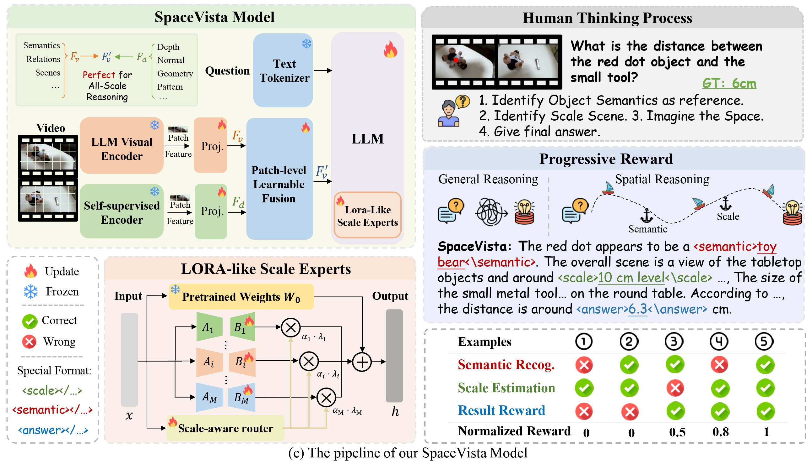 | 2025-08 | [Github](https://peiwensun2000.github.io/mm2km/) |
|  [See&Trek: Training-Free Spatial Prompting for Multimodal Large Language Model](https://arxiv.org/pdf/2509.16087) | 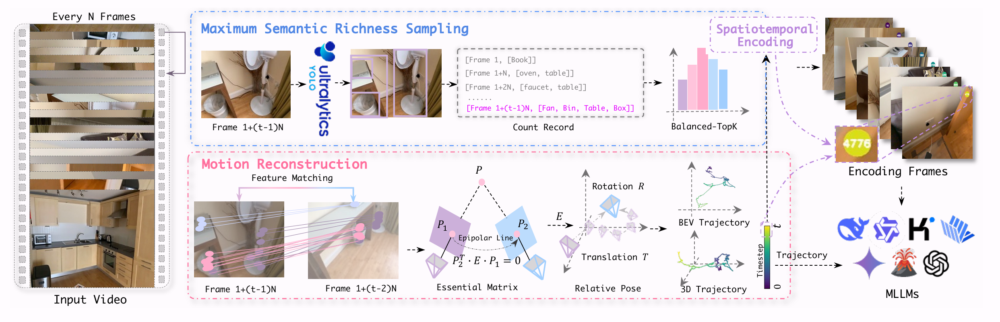 | 2025-09 | -|
|  [3D Aware Region Prompted Vision Language Model](https://arxiv.org/abs/2509.13317) | 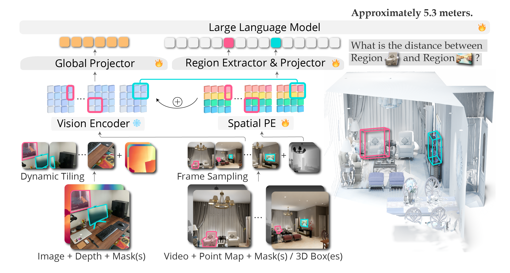 | 2025-09 | [Github](https://www.anjiecheng.me/sr3d) |
|  [UniUGG: Unified 3D Understanding and Generation via Geometric-Semantic Encoding](https://arxiv.org/abs/2508.11952) | 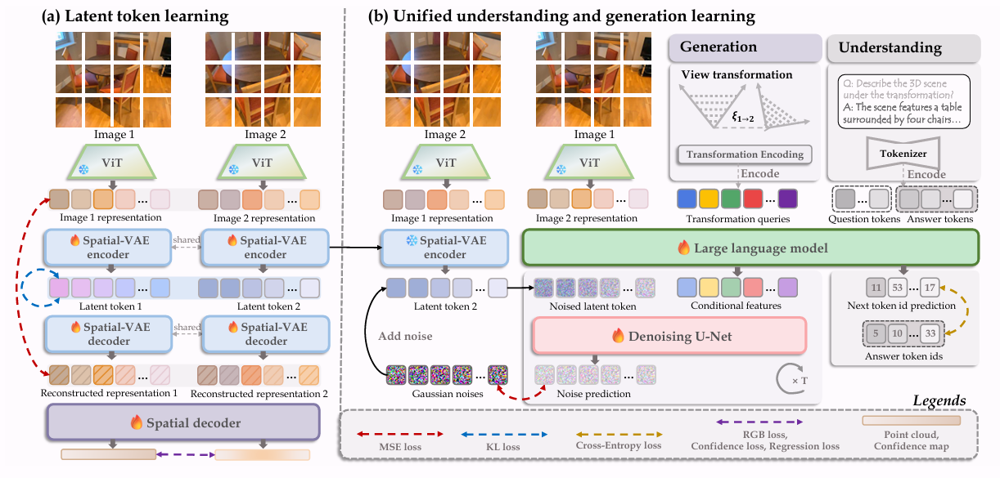 | 2025-08 | [Github](https://fudan-zvg.github.io/UniUGG) |
|  [Enhancing Spatial Reasoning through Visual and Textual Thinking](https://arxiv.org/abs/2507.20529) | 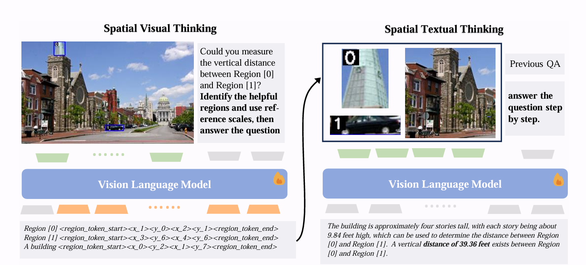 | 2025-07 | - |
|  [MindJourney: Test-Time Scaling with World Models for Spatial Reasoning](https://www.arxiv.org/abs/2507.12508) |  | 2025-07 | [Github](https://umass-embodied-agi.github.io/MindJourney/) |
|  [Struct2D: A Perception-Guided Framework for Spatial Reasoning in Large Multimodal Models](https://arxiv.org/pdf/2506.04220) | 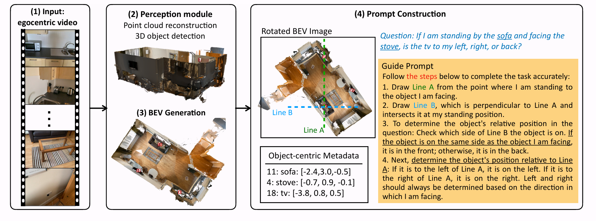 | 2025-06 | [Github](https://github.com/neu-vi/struct2d) |
|  [Fine-Grained Preference Optimization Improves Spatial Reasoning in VLMs](https://arxiv.org/abs/2506.21656) | 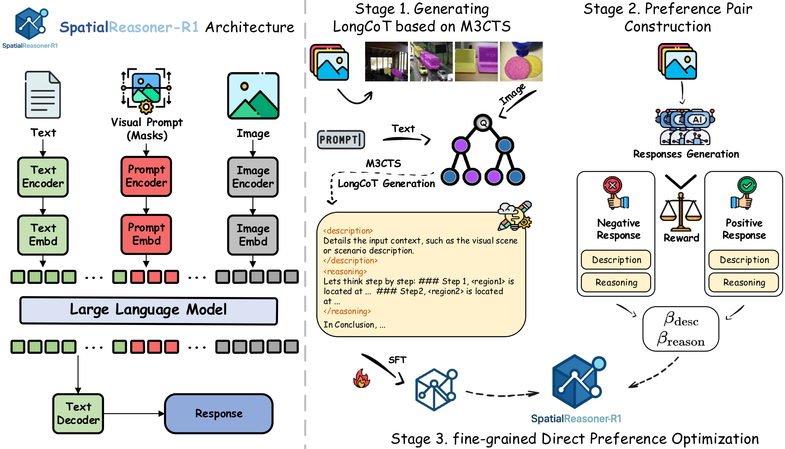 | 2025-06 | [Github](https://plan-lab.github.io/projects/spatialreasoner/) |
|  [SpatialLM: Training Large Language Models for Structured Indoor Modeling](https://arxiv.org/abs/2506.07491) | 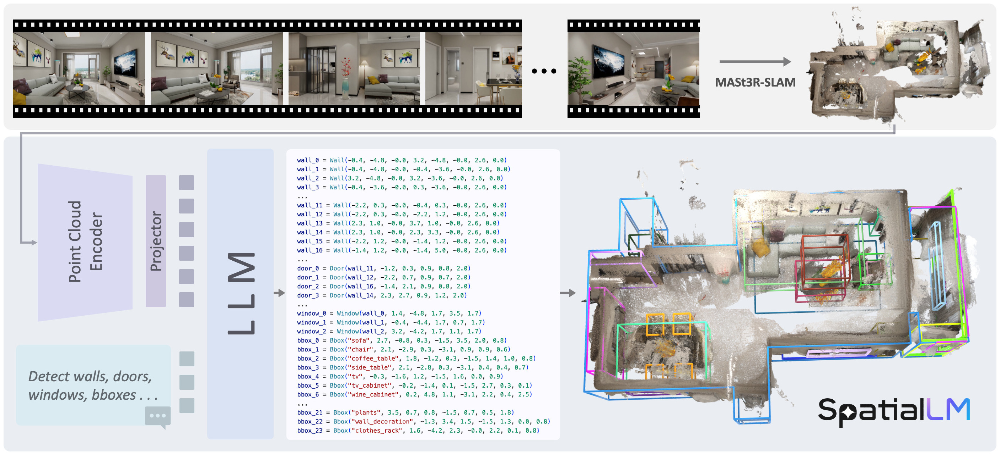 | 2025-06 | [Github](https://manycore-research.github.io/SpatialLM/) |
|  [Spatial Understanding from Videos: Structured Prompts Meet Simulation Data](https://arxiv.org/abs/2506.03642) | 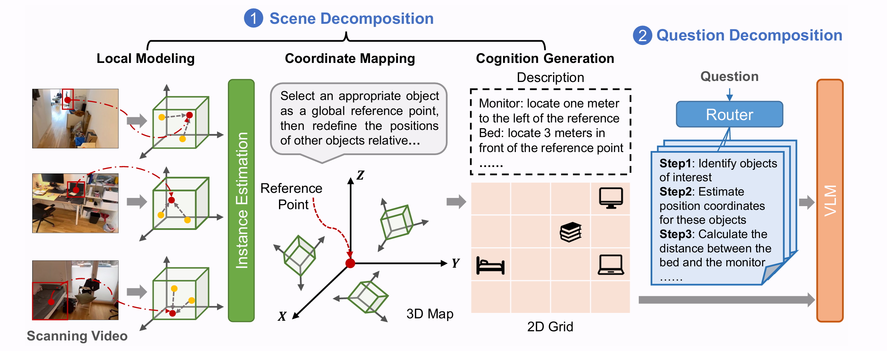 | 2025-06 | [Github](https://github.com/Hyu-Zhang/SpatialMind) |
|  [Reinforcing Spatial Reasoning in Vision-Language Models with Interwoven Thinking and Visual Drawing](https://arxiv.org/pdf/2506.09965) |  | 2025-06 | [Github](https://github.com/AntResearchNLP/ViLaSR) |
|  [Visual Embodied Brain: Let Multimodal Large Language Models See, Think, and Control in Spaces](https://arxiv.org/pdf/2506.00123v1) | 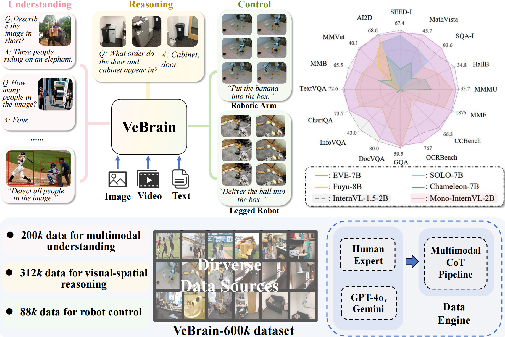 | 2025-05 | [Github](https://internvl.github.io/blog/2025-05-26-VeBrain/) |
|  [RoboRefer: Towards Spatial Referring with Reasoning in Vision-Language Models for Robotics](https://arxiv.org/pdf/2506.04308) | 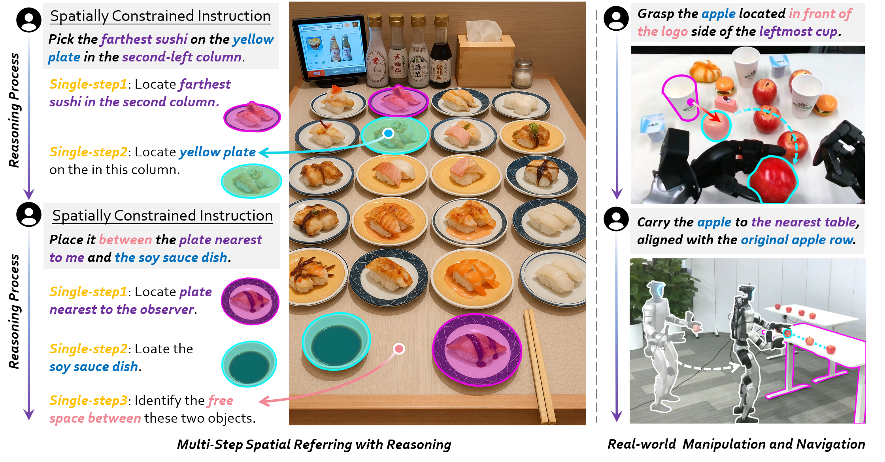 | 2025-05 | [Github](https://github.com/Zhoues/RoboRefer) |
|  [Learning from Videos for 3D World: Enhancing MLLMs with 3D Vision Geometry Priors](https://arxiv.org/pdf/2505.24625) |   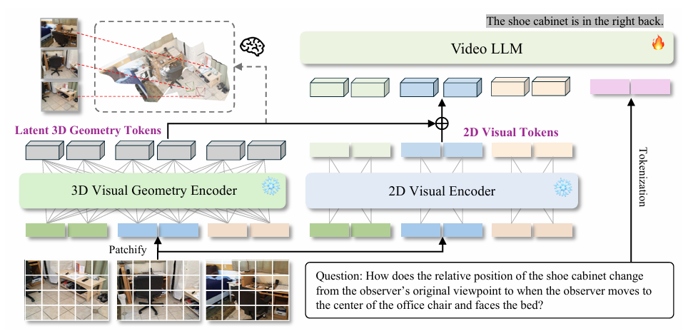   | 2025-05 |    [Github](https://lavi-lab.github.io/VG-LLM)   |
|  [SpatialLLM: A Compound 3D-Informed Design towards Spatially-Intelligent Large Multimodal Models](https://arxiv.org/abs/2505.00788) |      | 2025-05 |    [Github](https://3d-spatial-reasoning.github.io/spatial-llm/)   |
|  [ Spatial-MLLM: Boosting MLLM Capabilities in Visual-based Spatial Intelligence](https://arxiv.org/pdf/2505.23747) |   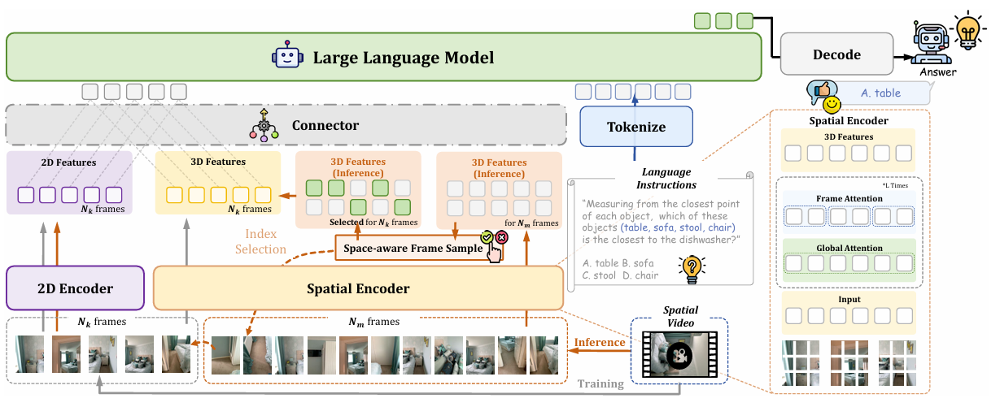   | 2025-05 |    [Github](https://diankun-wu.github.io/Spatial-MLLM/)   |
|  [STAR-R1: Spatial TrAnsformation Reasoning by Reinforcing Multimodal LLMs](https://arxiv.org/abs/2505.15804) |   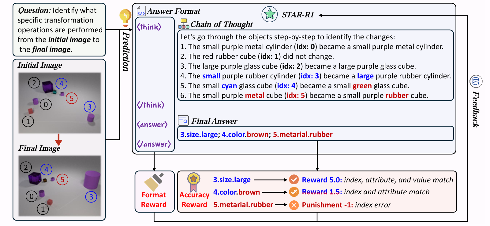   | 2025-05 |    [Github](https://github.com/zongzhao23/STAR-R1)   |
|  [VLM-3R: Vision-Language Models Augmented with Instruction-Aligned 3D Reconstruction](https://arxiv.org/pdf/2505.20279) |   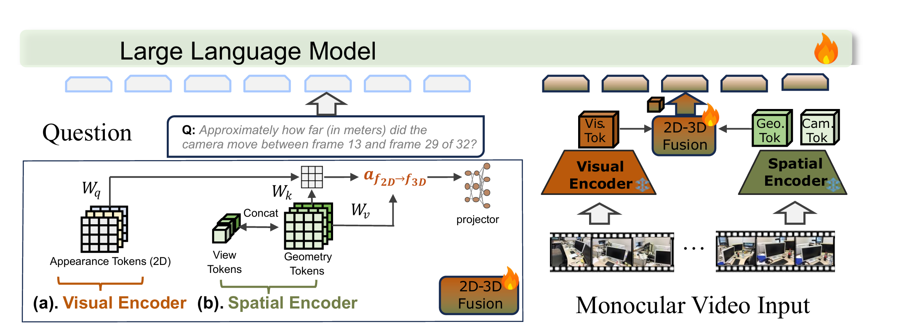   | 2025-05 |    [Github](https://github.com/VITA-Group/VLM-3R)   |
|  [LLaVA-4D: Embedding SpatioTemporal Prompt into LMMs for 4D Scene Understanding](https://arxiv.org/abs/2505.12253) |   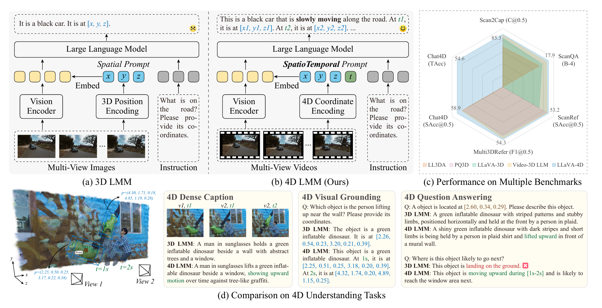   | 2025-05 |        -    |
|  [SSR: Enhancing Depth Perception in Vision-Language Models via Rationale-Guided Spatial Reasoning](https://arxiv.org/abs/2505.12448) |   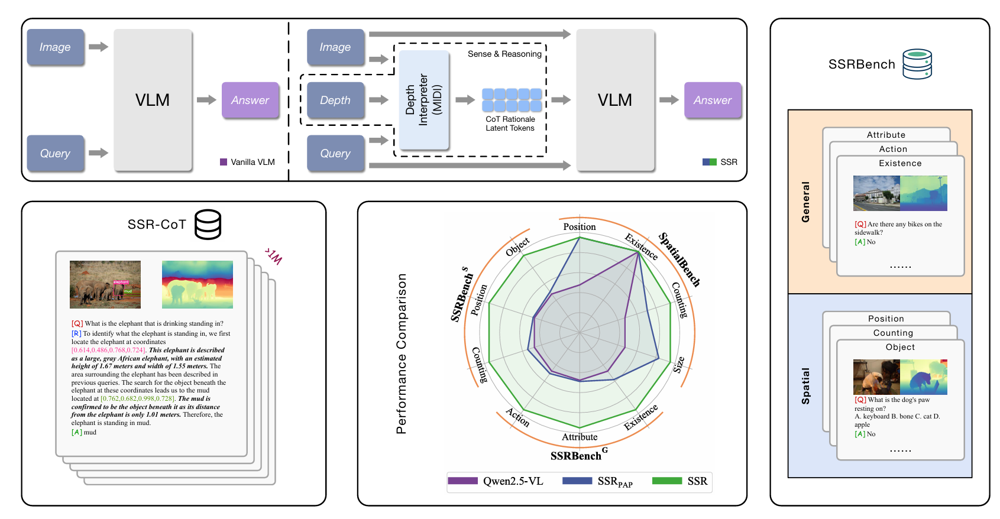   | 2025-05 |    [Github](https://yliu-cs.github.io/SSR)        |
|  [Perspective-Aware Reasoning in Vision-Language Models via Mental Imagery Simulation](https://arxiv.org/pdf/2504.17207) |   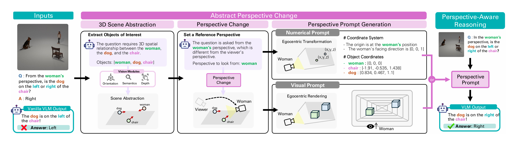   | 2025-04 |     [Github](https://apc-vlm.github.io/)     |
|  [SpaceR: Reinforcing MLLMs in Video Spatial Reasoning](https://arxiv.org/abs/2504.01805) |   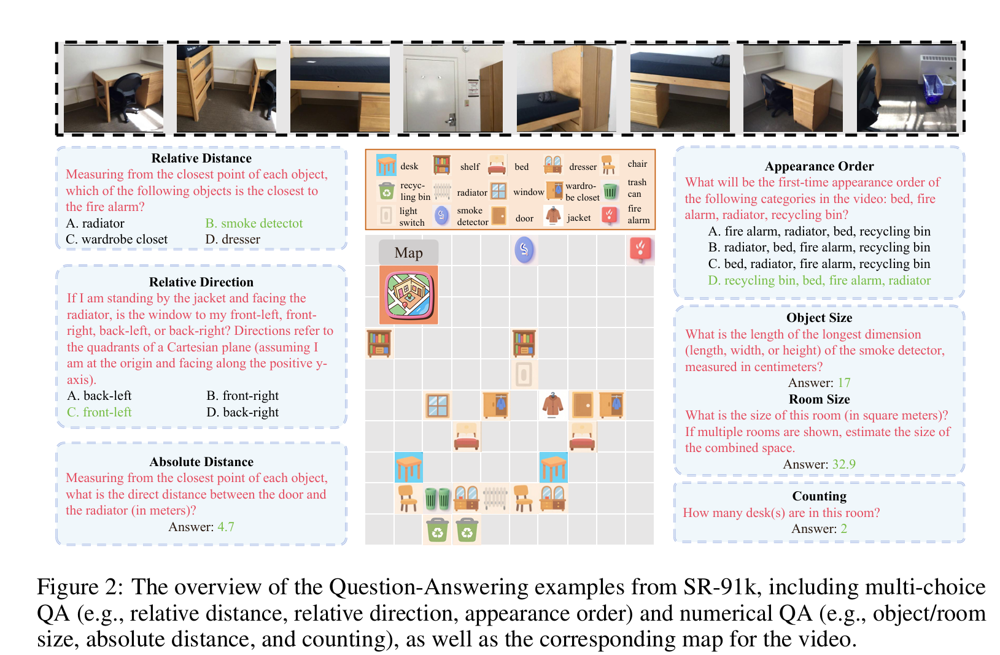   | 2025-04 |          [Github](https://github.com/OuyangKun10/SpaceR)         |
|  [Embodied-R: Collaborative Framework for Activating Embodied Spatial Reasoning in Foundation Models via Reinforcement Learning](https://arxiv.org/abs/2504.12680) |      | 2025-04 |          [Github](https://github.com/EmbodiedCity/Embodied-R.code)   |
|  [SpatialReasoner: Towards Explicit and Generalizable 3D Spatial Reasoning](https://arxiv.org/abs/2504.20024) |   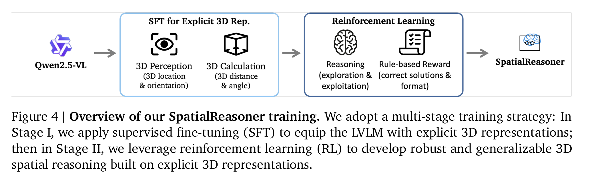   | 2025-04 |  [Github](https://spatial-reasoner.github.io/) |
|  [ROSS3D: Reconstructive Visual Instruction Tuning with 3D-Awareness](https://arxiv.org/pdf/2504.01901) |   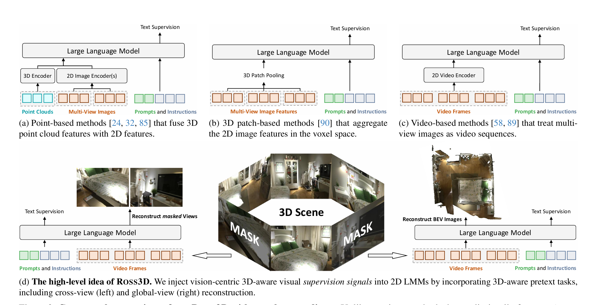   | 2025-04 |      [Github](https://github.com/haochen-wang409/ross3d)   |
|   [SpaRE: Enhancing Spatial Reasoning in Vision-Language Models with Synthetic Data](https://arxiv.org/abs/2504.20648) |   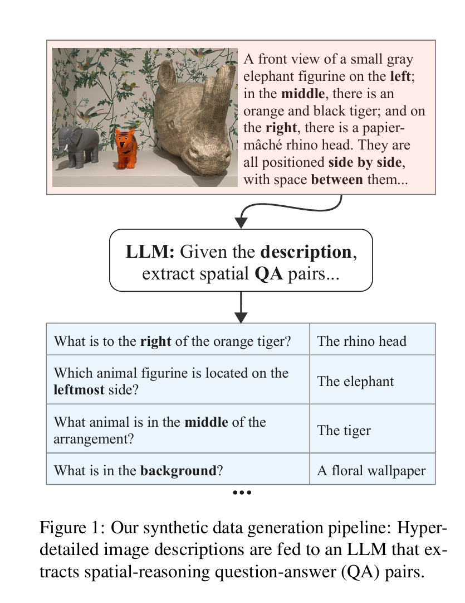   | 2025-04 |      -     |
|  [Visual Agentic AI for Spatial Reasoning with a Dynamic API](https://arxiv.org/pdf/2502.06787) |   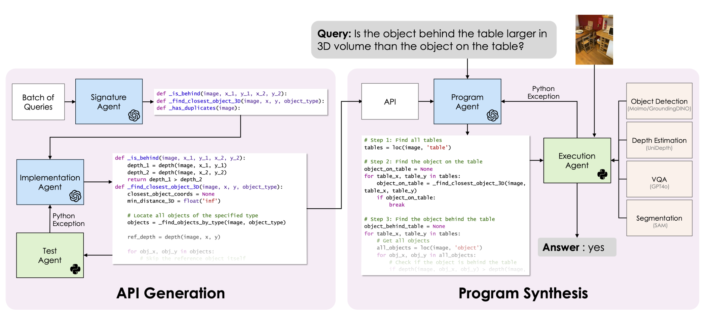   | 2025-02 |         [Github](https://glab-caltech.github.io/vadar/)         |
|  [SpatialCoT: Advancing Spatial Reasoning through Coordinate Alignment and Chain-of-Thought for Embodied Task Planning](https://arxiv.org/abs/2501.10074) |      | 2025-01 |         [Github](https://spatialcot.github.io/)         |
|  [COARSE CORRESPONDENCES Boost Spatial-Temporal Reasoning in Multimodal Language Model](https://arxiv.org/pdf/2408.00754) |   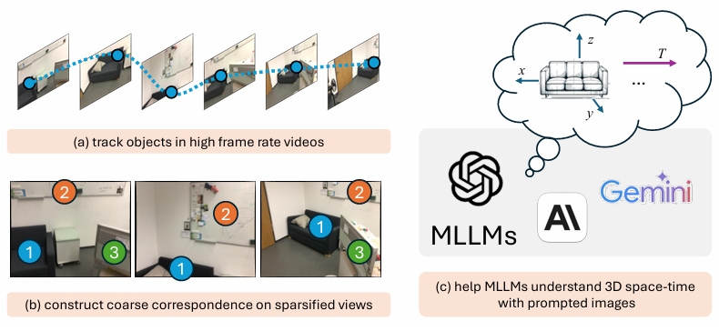   | 2024-08 |         [Github](https://coarse-correspondence.github.io/)         |
|   [SpatialRGPT: Grounded Spatial Reasoning in Vision Language Models](https://arxiv.org/abs/2406.01584) |      | 2024-06 |         [Github](https://github.com/AnjieCheng/SpatialRGPT)         |
  [SpatialBot: Precise Spatial Understanding with Vision Language Models](https://arxiv.org/abs/2406.13642) |      | 2024-06 |       [Github](https://github.com/BAAI-DCAI/SpatialBot)     |
|   [Learning to Localize Objects Improves Spatial Reasoning in Visual-LLMs](https://arxiv.org/abs/2404.07449) |      | 2024-04 |         [Github](https://github.com/kahnchana/locvlm)         |
|   [SpatialPIN: Enhancing Spatial Reasoning Capabilities of Vision-Language Models through Prompting and Interacting 3D Priors](https://arxiv.org/pdf/2403.13438) |   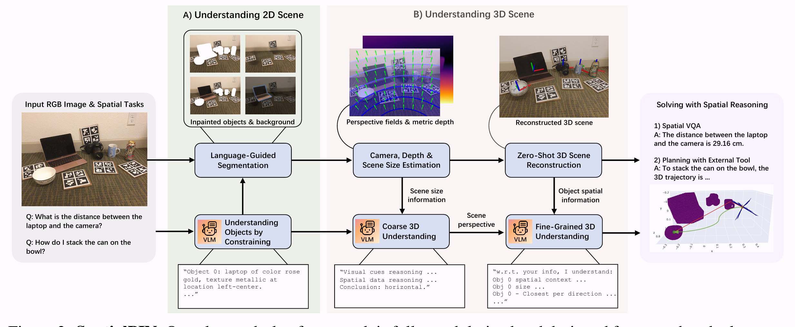   | 2024-03 | - |
|   [Can Transformers Capture Spatial Relations between Objects?](https://arxiv.org/abs/2403.00729) |      | 2024-03 |  [Github](https://github.com/AlvinWen428/spatial-relation-benchmark) |
|   [SpatialVLM: Endowing Vision-Language Models with Spatial Reasoning Capabilities](https://arxiv.org/abs/2401.12168) |     | 2024-01 | [Github](https://github.com/remyxai/VQASynth)|
|   [Proximity QA: Unleashing the Power of Multi-Modal Large Language Models for Spatial Proximity Analysis](https://arxiv.org/abs/2401.17862) |      | 2024-01 |         [Github](https://github.com/NorthSummer/ProximityQA)         |
|  [3DAxiesPrompts: Unleashing the 3D Spatial Task Capabilities of GPT-4V](https://arxiv.org/abs//2312.09738) |      | 2023-12 |    -   |

### Text based
| Title                                                        |                        Introduction                         |    Date    |                             Code                             |
| :----------------------------------------------------------- | :---------------------------------------------------------: | :--------: | :----------------------------------------------------------: |
|  [Imagine while Reasoning in Space: Multimodal Visualization-of-Thought](https://arxiv.org/abs/2501.07542) |      | 2025-01 |   -       |
|  [Dspy-based Neural-Symbolic Pipeline to Enhance Spatial Reasoning in LLMs](https://arxiv.org/abs/2411.18564) |      | 2024-11 |       -       |
|   [Sparkle: Mastering Basic Spatial Capabilities in Vision Language Models Elicits Generalization to Composite Spatial Reasoning](https://arxiv.org/abs/2410.16162) |   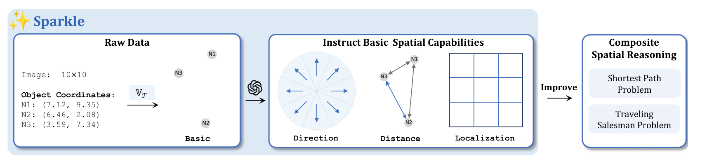   | 2024-10 |     -     |
|   [SpaRC and SpaRP: Spatial Reasoning Characterization and Path Generation for Understanding Spatial Reasoning Capability of Large Language Models](https://arxiv.org/abs/2406.04566) |      | 2024-06 |         [Github](https://github.com/UKPLab/acl2024-sparc-and-sparp)         |
|   [Beyond Lines and Circles: Unveiling the Geometric Reasoning Gap in Large Language Models](https://arxiv.org/abs/2402.03877) |      | 2024-02 |       -       |
|   [Advancing Spatial Reasoning in Large Language Models: An In-Depth Evaluation and Enhancement Using the StepGame Benchmark](https://arxiv.org/abs/2401.03991) |      | 2024-01 |      [Github](https://github.com/Fangjun-Li/SpatialLM-StepGame)    |

## Datasets & Benchmark
### Visual based
| Title                                                        |                         Introduction                         |    Date    |                           Code                           |
| :----------------------------------------------------------- | :----------------------------------------------------------: | :--------: | :------------------------------------------------------: |
|   [DSI-Bench: A Benchmark for Dynamic Spatial Intelligence](https://arxiv.org/abs/2510.18873) |   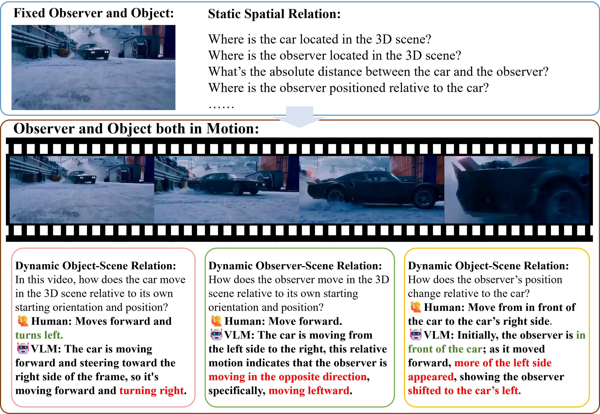   | 2025-10 |          [Github](https://dsibench.github.io/) |
|   [Seeing Across Views: Benchmarking Spatial Reasoning of Vision-Language Models in Robotic Scenes](https://arxiv.org/pdf/2510.19400) |   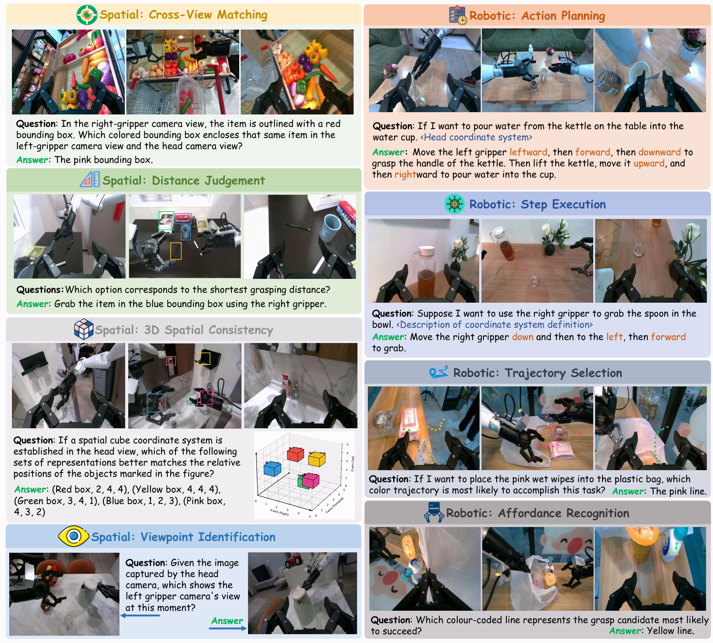   | 2025-10 |           - |
|   [NavSpace: How Navigation Agents Follow Spatial Intelligence Instructions](https://arxiv.org/abs/2510.08173) |   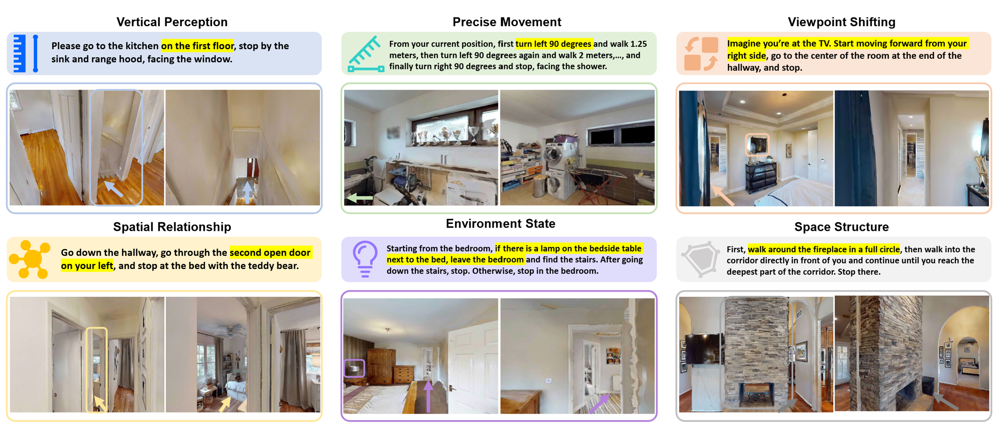   | 2025-10 |        [Github](https://navspace.github.io/#NavSpace-Leaderboard)  |
|   [SpinBench: Perspective and Rotation as a Lens on Spatial Reasoning in VLMs](https://arxiv.org/abs/2509.25390) |   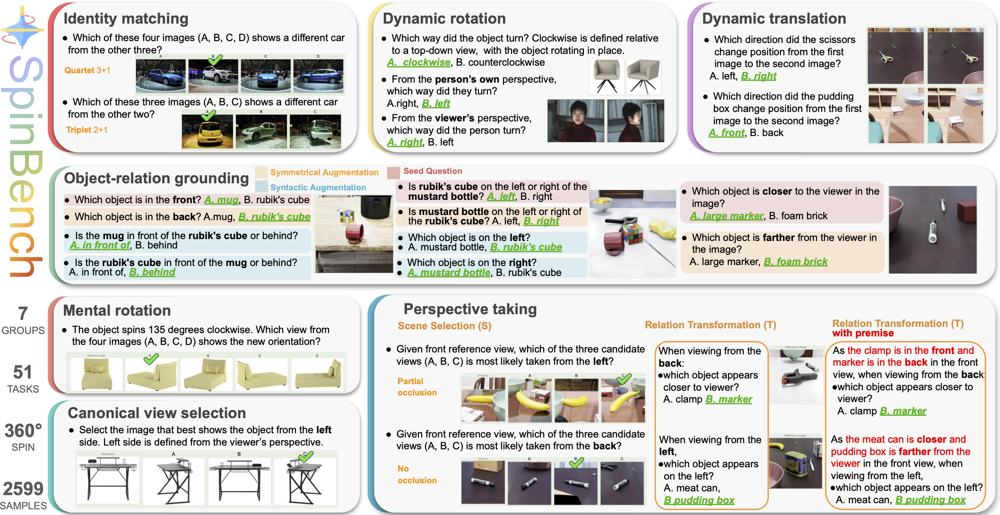   | 2025-09 |          [Github](https://spinbench25.github.io/) |
|   [Spatial Reasoning with Vision-Language Models in Ego-Centric Multi-View Scenes](https://arxiv.org/pdf/2509.06266) |   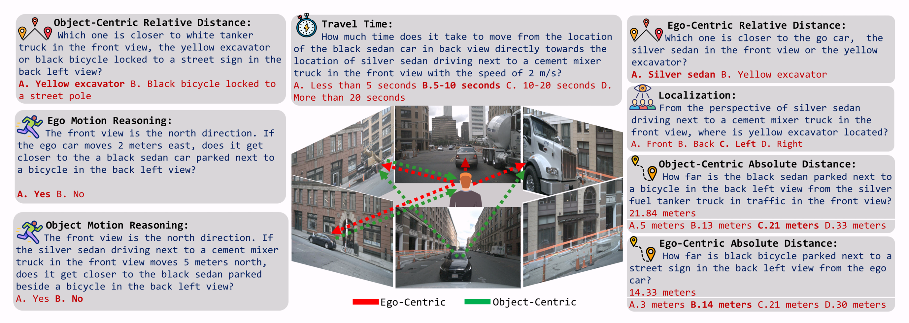   | 2025-09 |             [Github](https://vbdi.github.io/Ego3D-Bench-webpage/) |
|   [Why Do MLLMs Struggle with Spatial Understanding? A Systematic Analysis from Data to Architecture](https://arxiv.org/abs/2509.02359) |   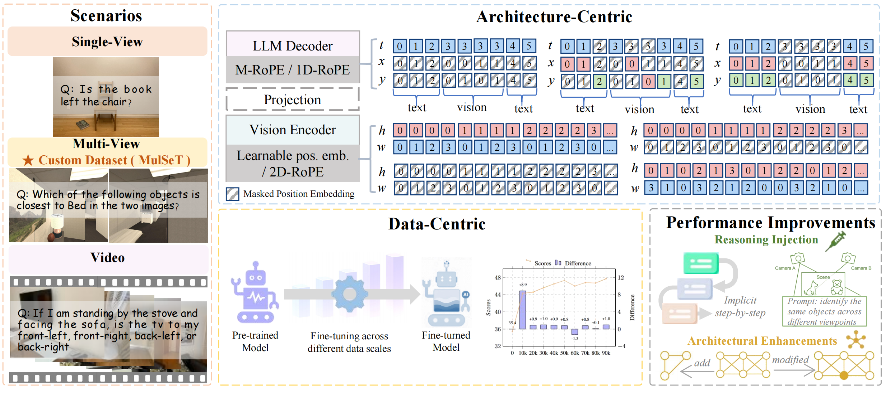   | 2025-09 |     [Github](https://github.com/WanyueZhang-ai/spatial-understanding)   |
|   [SpatialVID: A Large-Scale Video Dataset with Spatial Annotations](https://arxiv.org/abs/2509.09676) |   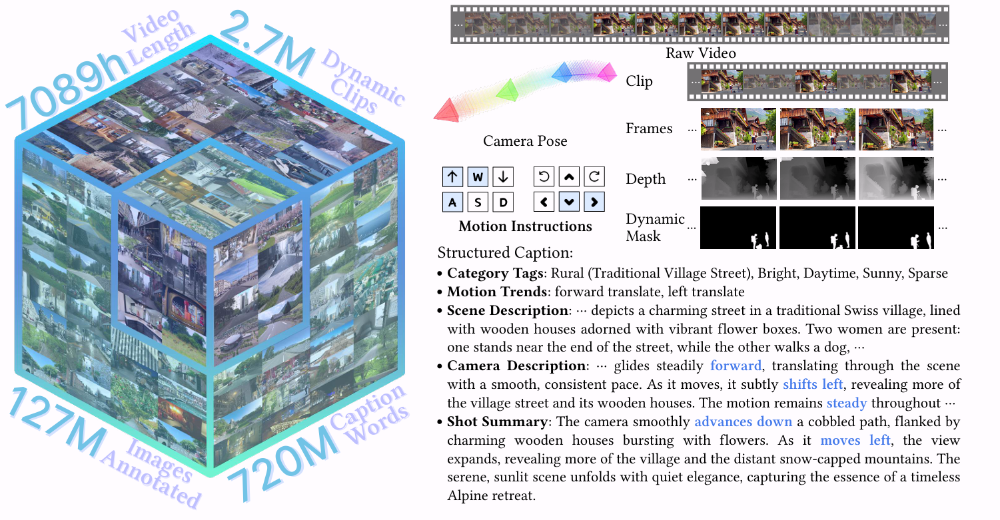   | 2025-09 |     [Github](https://nju-3dv.github.io/projects/SpatialVID)   |
|   [11Plus-Bench: Demystifying Multimodal LLM Spatial Reasoning with Cognitive-Inspired Analysis](https://arxiv.org/html/2508.20068v1) |   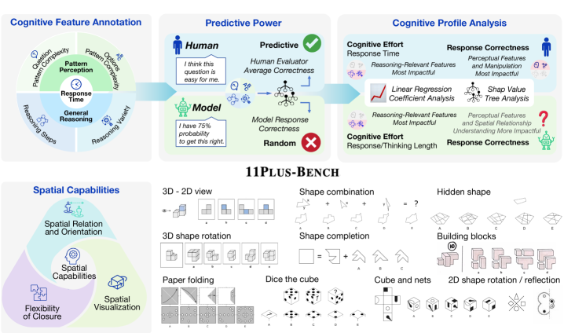   | 2025-08 |   -  |
|   [Towards Scalable Spatial Intelligence via 2D-to-3D Data Lifting](https://arxiv.org/pdf/2507.18678) |   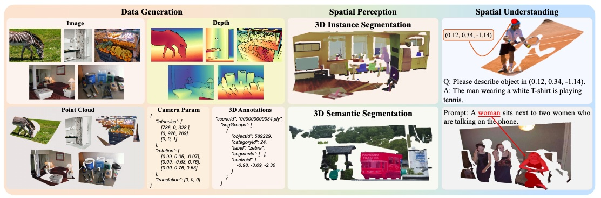   | 2025-07 |     [Github](https://zhanggongjie.github.io/TowardsSSI-page/)   |
|   [Ascending the Infinite Ladder: Benchmarking Spatia](https://arxiv.org/pdf/2507.02978v1) |   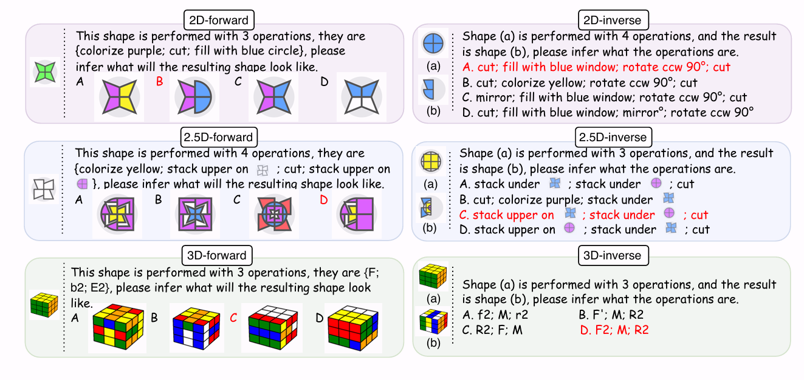 | 2025-07 | -  |
|   [SpatialViz-Bench: An MLLM Benchmark for Spatial Visualization](https://web3.arxiv.org/pdf/2507.07610) |   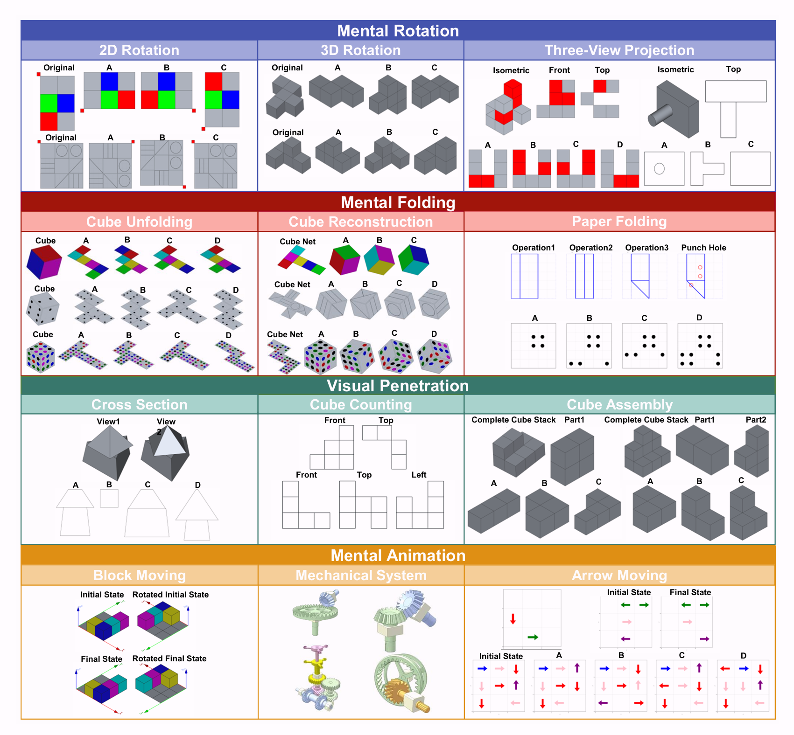 | 2025-07 | [Github](https://huggingface.co/datasets/PLM-Team/Spatial-Visualization-Benchmark)   |
|   [Spatial Mental Modeling from Limited Views](https://arxiv.org/abs/2506.21458) |   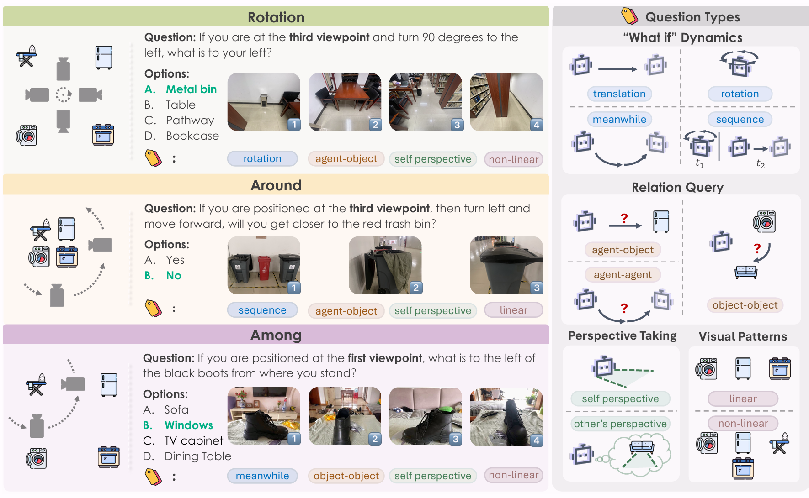   | 2025-06 |             [Github](https://mind-cube.github.io/) |
|   [SIRI-Bench: Challenging VLMs' Spatial Intelligence through Complex Reasoning Tasks](https://arxiv.org/pdf/2506.14512) |   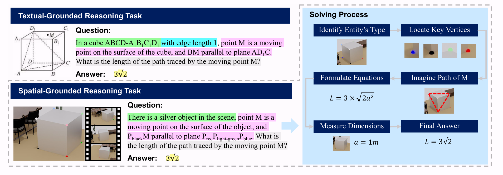   | 2025-06 |        - |
|  [IR3D-Bench: Evaluating Vision-Language Model Scene Understanding as Agentic Inverse Rendering](https://arxiv.org/abs/2506.23329) | 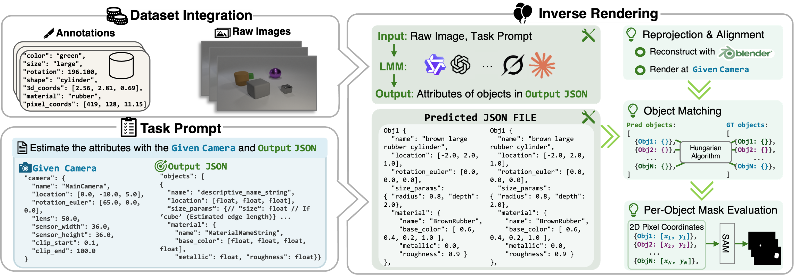 | 2025-06 | [Github](https://ir3d-bench.github.io/) |
|  [PhyBlock: A Progressive Benchmark for Physical Understanding and Planning via 3D Block Assembly](https://arxiv.org/abs/2506.08708) |      | 2025-06 |             [Github](https://phyblock.github.io/) 
|   [Can Vision Language Models Infer Human Gaze Direction? A Controlled Study](https://arxiv.org/abs/2506.05412) |   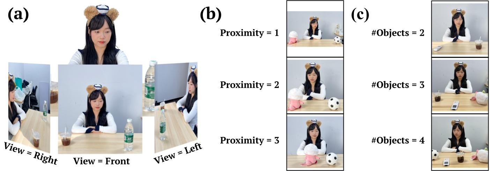   | 2025-06 |             [Github](https://grow-ai-like-a-child.github.io/gaze/) 
|   [SpaCE-10: A Comprehensive Benchmark for Multimodal Large Language Models in Compositional Spatial Intelligence](https://arxiv.org/abs/2506.07966) |   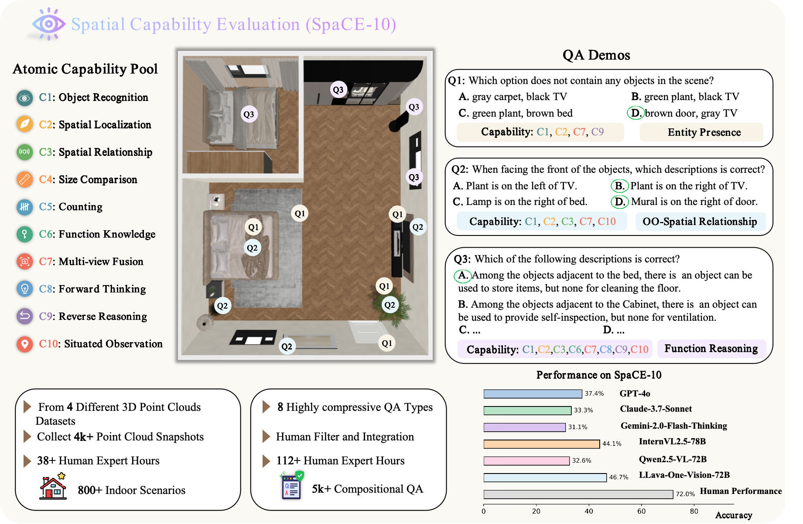   | 2025-06 |             [Github](https://github.com/VisionXLab/SpaCE-10) 
|   [Unfolding Spatial Cognition: Evaluating Multimodal Models on Visual Simulations](https://arxiv.org/pdf/2506.04633) |   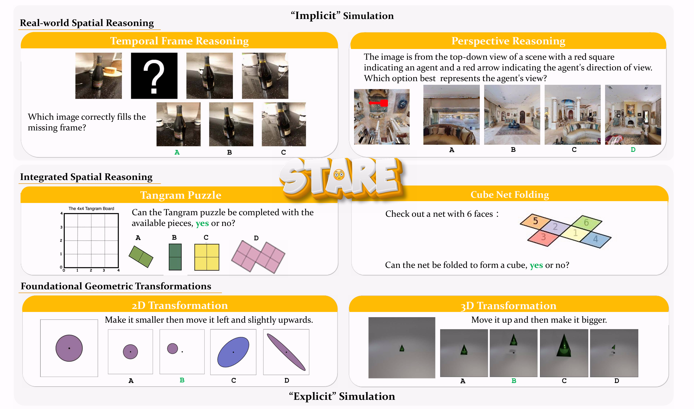   | 2025-06 |             [Github](https://github.com/VisionXLab/SpaCE-10) 
|   [OmniSpatial: Towards Comprehensive Spatial Reasoning Benchmark for Vision Language Models](https://arxiv.org/pdf/2506.03135) |   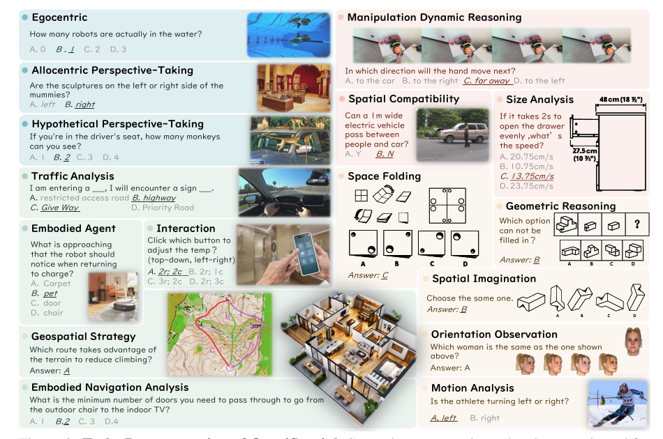   | 2025-06 |             [Github](https://github.com/qizekun/OmniSpatial) 
|   [InternSpatial: A Comprehensive Dataset for Spatial Reasoning in Vision-Language Models](https://arxiv.org/pdf/2506.18385) |   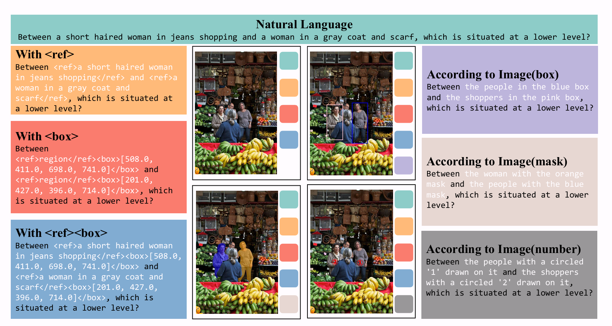   | 2025-06 |           -|
|   [MMSI-Bench: A Benchmark for Multi-Image Spatial Intelligence](https://arxiv.org/pdf/2505.23764) |   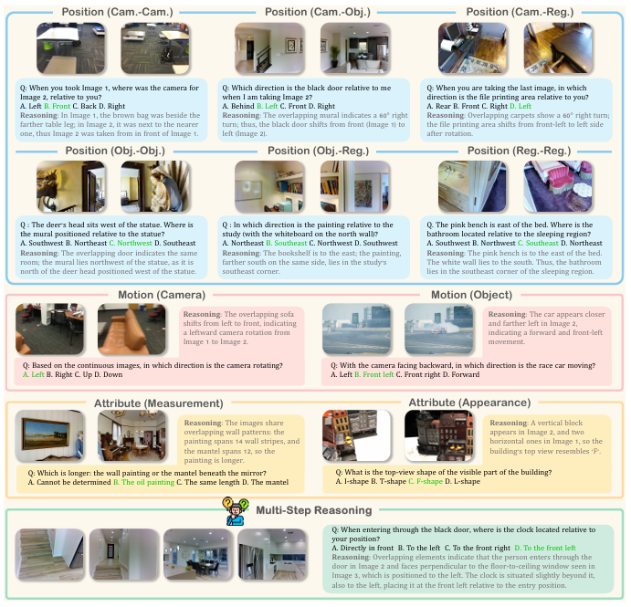   | 2025-05 |             [Github](https://runsenxu.com/projects/MMSI_Bench) 
|   [Multi-SpatialMLLM: Multi-Frame Spatial Understanding with Multi-Modal Large Language Models](https://arxiv.org/pdf/2505.17015) |   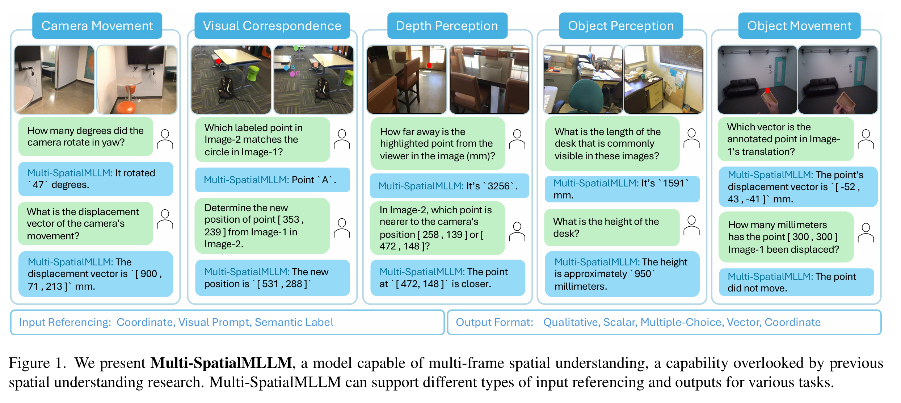   | 2025-05 |             [Github](https://runsenxu.com/projects/Multi-SpatialMLLM)  
|   [SpatialScore: Towards Unified Evaluation for Multimodal Spatial Understanding](https://arxiv.org/pdf/2505.17012) |   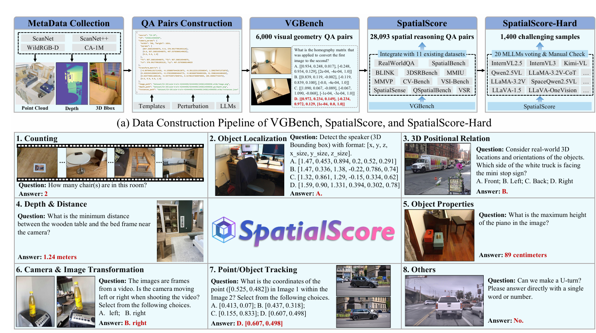   | 2025-05 |  [Github](https://haoningwu3639.github.io/SpatialScore) |
|   [MIRAGE:A Multi-modal Benchmark for Spatial Perception, Reasoning, and Intelligence](https://arxiv.org/pdf/2505.10604) |      | 2025-05 |  [Github](https://github.com/khazic/Mirage) |
|   [Can Multimodal Large Language Models Understand Spatial Relations](https://arxiv.org/pdf/2505.10604) |   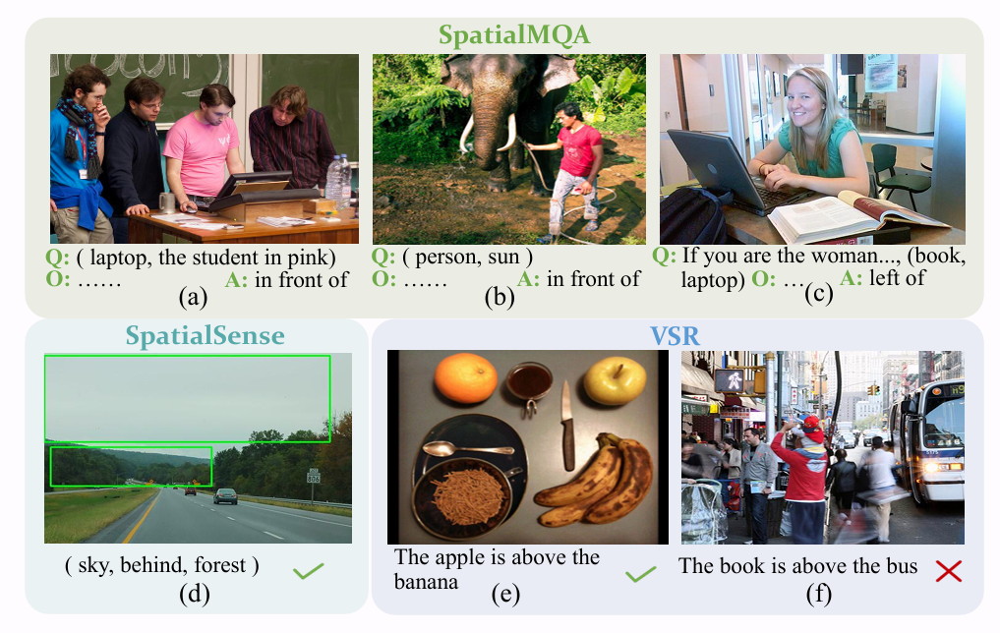   | 2025-05 |  [Github](https://github.com/ziyan-xiaoyu/SpatialMQA.git) |
|   [Visuospatial Cognitive Assistant](https://arxiv.org/pdf/2505.12312) |   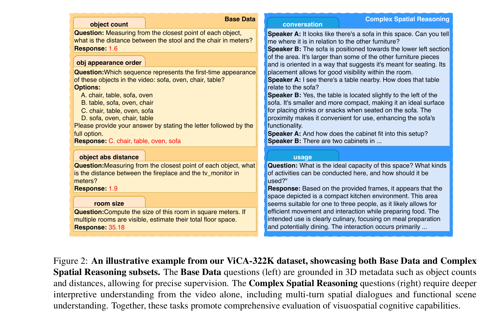   | 2025-05 |             [Github](https://huggingface.co/nkkbr/ViCA) 
|   [Are Multimodal Large Language Models Ready for Omnidirectional Spatial Reasoning?](https://arxiv.org/pdf/2505.19015) |   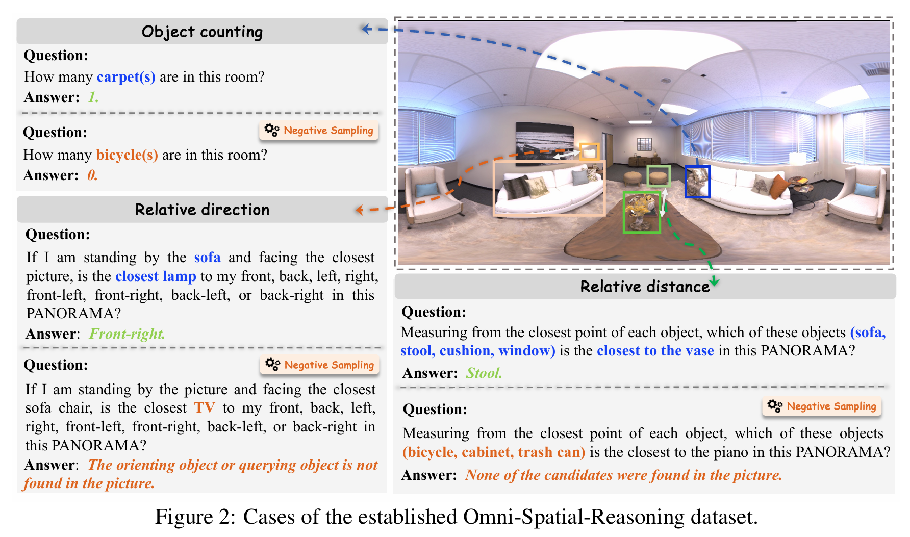   | 2025-05 | [Github](https://huggingface.co/datasets/UUUserna/OSR-Bench) 
|   [Vision language models have difficulty recognizing virtual objects](https://arxiv.org/abs/2505.10453) |   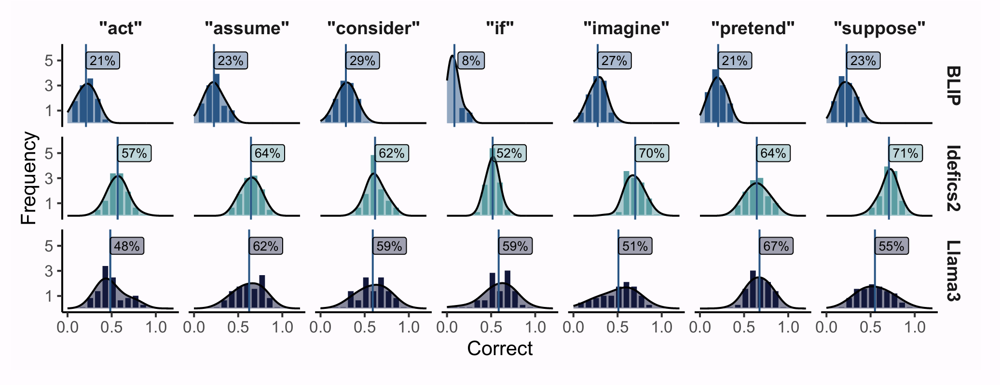   | 2025-05 | -
|   [ViewSpatial-Bench: Evaluating Multi-perspective Spatial Localization in Vision-Language Models](https://arxiv.org/pdf/2505.21500) |      | 2025-05 | [Github](https://zju-real.github.io/ViewSpatial-Page) |
|   [Out of Sight, Not Out of Context? Egocentric Spatial Reasoning in VLMs Across Disjoint Frames](https://arxiv.org/abs/2505.24257) |      | 2025-05 | - |
|   [SITE: towards Spatial Intelligence Thorough Evaluation](https://arxiv.org/pdf/2505.05456) |   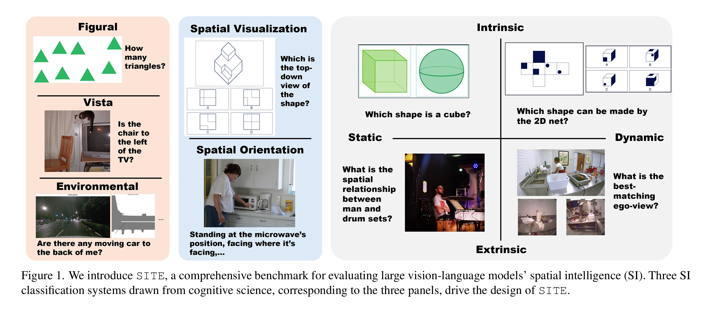   | 2025-05 |   [Github](https://wenqi-wang20.github.io/SITE-Bench.github.io/)  
|   [CameraBench: Towards Understanding Camera Motions in Any Video](http://arxiv.org/abs/2504.15376) |   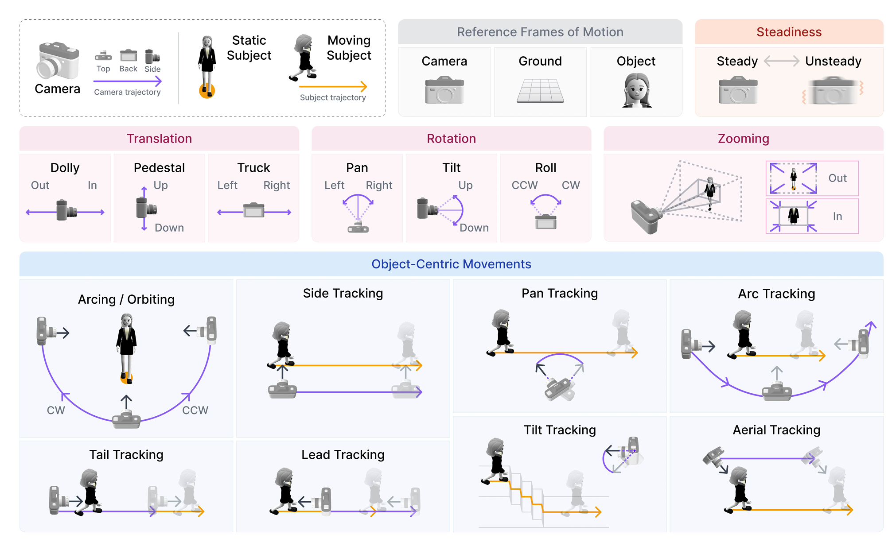   | 2025-04 |  [Github](https://linzhiqiu.github.io/papers/camerabench/)  
|   [Seeing from Another Perspective: Evaluating Multi-View Understanding in MLLMs](http://arxiv.org/abs/2504.15280) |   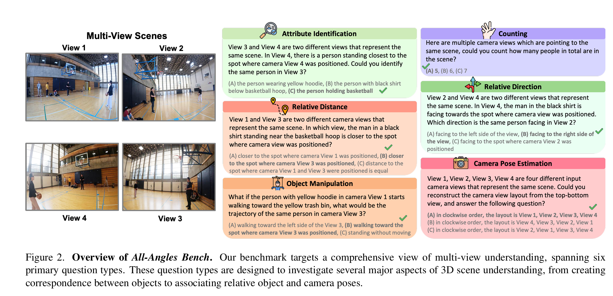  | 2025-04 | [Github](https://danielchyeh.github.io/All-Angles-Bench/) 
|   [From Flatland to Space:Teaching Vision-Language Models to Perceive and Reason in 3D](https://arxiv.org/abs/2503.11094) |   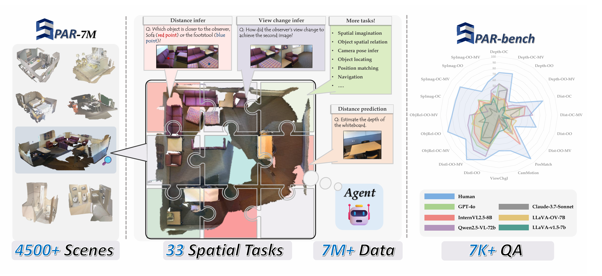   | 2025-03 | [Github](https://fudan-zvg.github.io/spar) 
|   [MM-Spatial: Exploring 3D Spatial Understanding in Multimodal LLM](https://arxiv.org/abs/2503.13111) |   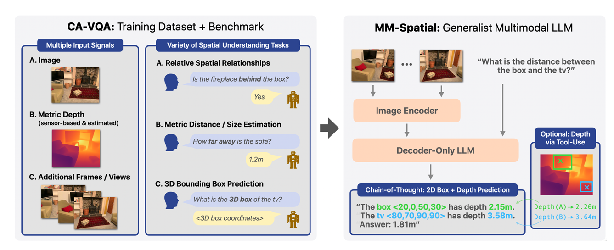   | 2025-03 | -
|   [Open3DVQA: A Benchmark for Comprehensive Spatial Reasoning with Multimodal Large Language Model in Open Space](https://arxiv.org/abs/2503.11094) |   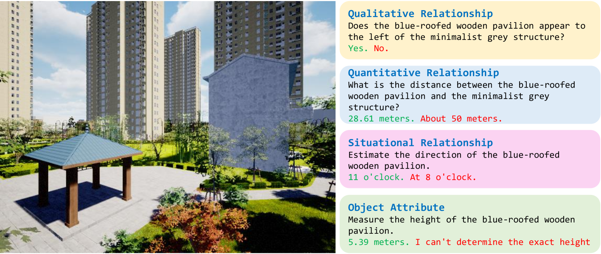   | 2025-03 |             [Github](https://github.com/WeichenZh/Open3DVQA)
|   [STI-Bench: Are MLLMs Ready for Precise Spatial-Temporal World Understanding?](http://arxiv.org/abs/2503.23765) |   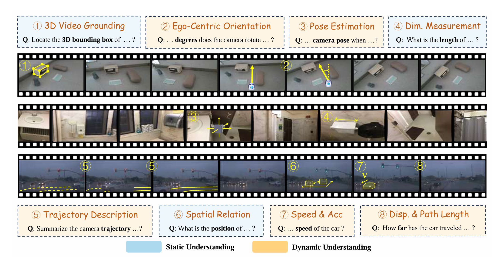   | 2025-03 |             [Github](https://mint-sjtu.github.io/STI-Bench.io/)      
|   [CoSpace: Benchmarking Continuous Space Perception Ability for Vision-Language Models](https://arxiv.org/abs/2503.14161) |   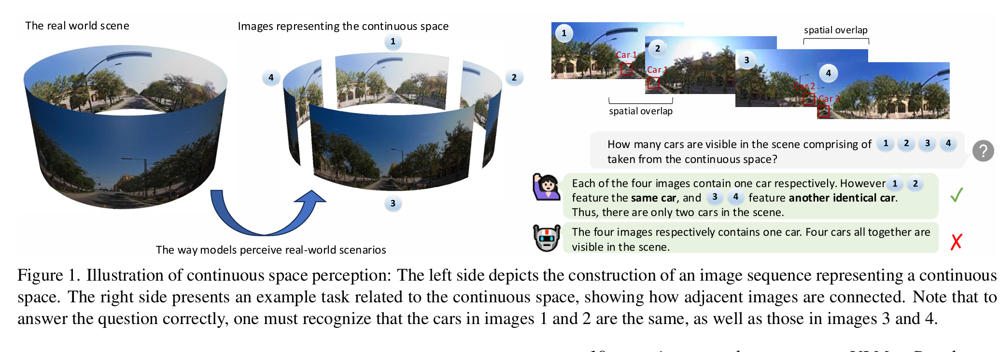   | 2025-03 |             [Github](https://github.com/THUNLP-MT/CoSpace/)   
|   [Mind the Gap: Benchmarking Spatial Reasoning in Vision-Language Models](https://arxiv.org/pdf/2503.19707) |   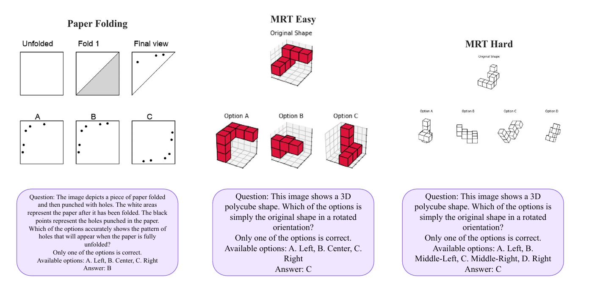   | 2025-03 |    [Github](https://github.com/stogiannidis/srbench)
|   [LEGO-Puzzles: How Good Are MLLMs at Multi-Step Spatial Reasoning?](http://arxiv.org/abs/2503.19990) |   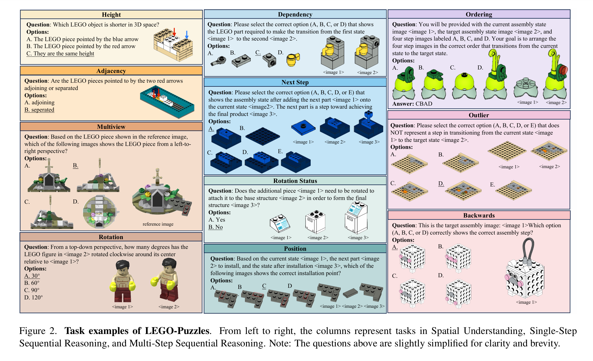   | 2025-03 |            [Github](https://tangkexian.github.io/LEGO-Puzzles/)
|   [Spatial457: A Diagnostic Benchmark for 6D Spatial Reasoning of Large Multimodal Models](https://arxiv.org/abs/2502.08636) |      | 2025-02 |             [Github](https://xingruiwang.github.io/projects/Spatial457/) 
|   [FoREST: Frame of Reference Evaluation in Spatial Reasoning Tasks](https://arxiv.org/abs/2502.17775) |      | 2025-02 |      - |
|   [iVISPAR — An Interactive Visual-Spatial Reasoning Benchmark for VLMs](https://arxiv.org/abs/2502.03214) |      | 2025-02 | [Github](https://github.com/SharkyBamboozle/iVISPAR)  |
|   [Defining and Evaluating Visual Language Models' Basic Spatial Abilities: A Perspective from Psychometrics](http://arxiv.org/abs/2502.11859) |      | 2025-02 |    -          |
|   [SAT: Spatial Aptitude Training for Multimodal Language Models](https://arxiv.org/abs/2412.07755) |      | 2024-12 |             [Github](https://arijitray1993.github.io/SAT/)          |
|  [SPHERE: A Hierarchical Evaluation on Spatial Perception and Reasoning for Vision-Language Models](https://arxiv.org/abs/2412.12693) |      | 2024-12 |             [Github](https://github.com/zwenyu/SPHERE-VLM)          |
|   [3DSRBench: A Comprehensive 3D Spatial Reasoning Benchmark](https://arxiv.org/abs/2412.07825) |      | 2024-12 |             [Github](https://3dsrbench.github.io/)          |
|   [Thinking in Space: How Multimodal Large Language Models See, Remember and Recall Spaces](https://arxiv.org/abs/2412.14171) |      | 2024-12 |             [Github](https://github.com/vision-x-nyu/thinking-in-space)          |
|   [RoboSpatial: Teaching Spatial Understanding to 2D and 3D Vision-Language Models for Robotics](https://arxiv.org/abs/2411.16537) |      | 2024-11 |         -   |
|   [An Empirical Analysis on Spatial Reasoning Capabilities of Large Multimodal Models](https://arxiv.org/abs/2411.06048) |      | 2024-11 |  -     |
|   [Is ‘Right’ Right? Enhancing Object Orientation Understanding in Multimodal Language Models through Egocentric Instruction Tuning](https://arxiv.org/pdf/2411.16761v1) |      | 2024-10 |             [Github](https://github.com/jhCOR/EgoOrientBench)          | 
|  [ActiView: Evaluating Active Perception Ability for Multimodal Large Language Models](https://arxiv.org/pdf/2410.04659) |   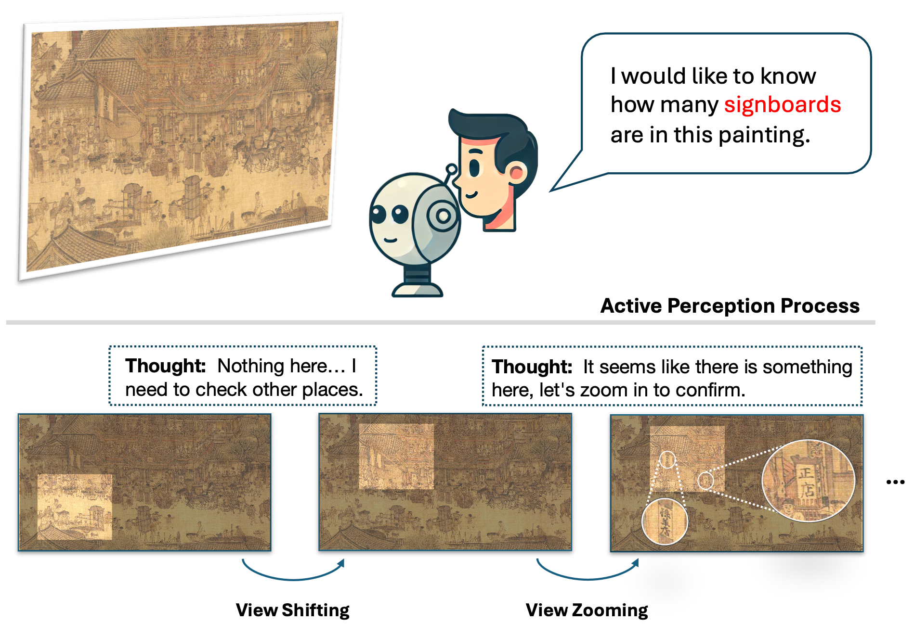   | 2024-10 |         [Github](https://wangphoebe.github.io/actiview_homepage/)         |
|   [ DOES SPATIAL COGNITION EMERGE IN FRONTIER MODELS?](https://arxiv.org/pdf/2410.06468) |   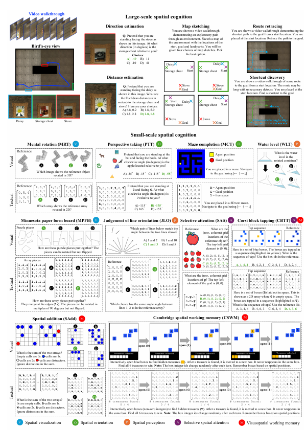   | 2024-10 | -
|   [Do Vision-Language Models Represent Space and How? Evaluating Spatial Frame of Reference Under Ambiguities](https://arxiv.org/abs/2410.17385) |      | 2024-10 |             [Github](https://github.com/sled-group/COMFORT)          | 
|   [R2D3: Imparting Spatial Reasoning by Reconstructing 3D Scenes from 2D Images](https://openreview.net/pdf?id=Ku4lylDpjq) |      | 2024-10 |             [Github](https://github.com/arijitray1993/r2d3/)          | 
|   [Reasoning Paths with Reference Objects Elicit Quantitative Spatial Reasoning in Large Vision-Language Models](https://arxiv.org/abs/2409.09788) |      | 2024-09 |             [Github](https://github.com/andrewliao11/Q-Spatial-Bench-code)          |          -     |
|   [Can Vision Language Models Learn from Visual Demonstrations of Ambiguous Spatial Reasoning?](https://arxiv.org/abs/2409.17080) |      | 2024-09 |       -     |
|   [VSP: Assessing the dual challenges of perception and reasoning in spatial planning tasks for VLMs](https://arxiv.org/abs/2407.01863) |   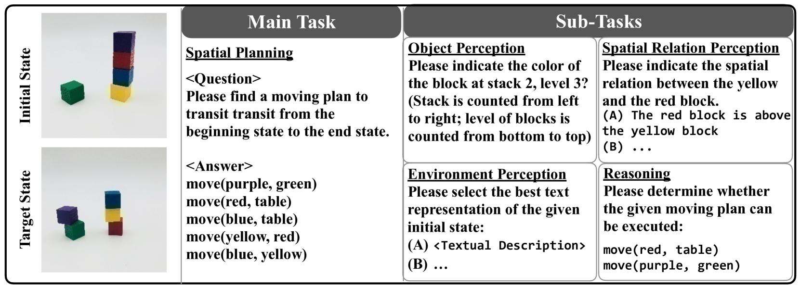   | 2024-07 |             [Github](https://github.com/UCSB-NLP-Chang/Visual-Spatial-Planning)    |
|   [EmbSpatial-Bench: Benchmarking Spatial Understanding for Embodied Tasks with Large Vision-Language Models](https://arxiv.org/abs/2406.05756) |      | 2024-06 |             [Github](https://github.com/mengfeidu/EmbSpatial-Bench)          |
|   [TopViewRS: Vision-Language Models as Top-View Spatial Reasoners](https://arxiv.org/abs/2406.05756) |      | 2024-06 |             [Github](https://github.com/cambridgeltl/topviewrs)          |
|   [Is A Picture Worth A Thousand Words? Delving Into Spatial Reasoning for Vision Language Models](https://arxiv.org/abs/2406.14852) |   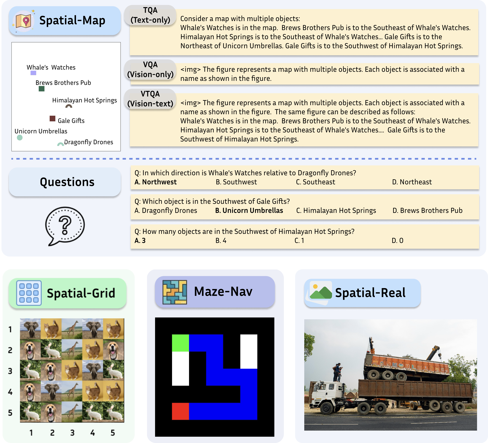   | 2024-06 |      [Github](https://github.com/jiayuww/SpatialEval)      |     -  |
|   [GSR-Bench: A Benchmark for Grounded Spatial Reasoning Evaluation via Multimodal LLMs](https://arxiv.org/abs/2406.13246) |      | 2024-06 |             -      |
|   [Reframing Spatial Reasoning Evaluation in Language Models: A Real-World Simulation Benchmark for Qualitative Reasoning](https://arxiv.org/abs/2405.15064) |      | 2024-05 |             [Github](https://github.com/Fangjun-Li/RoomSpace)          |
|    [Things not Written in Text: Exploring Spatial Commonsense from Visual Signals](https://arxiv.org/abs/2203.08075) |      | 2022-03 |   [Github](https://github.com/xxxiaol/spatial-commonsense)
|   [SPARE3D: ADataset for SPAtial REasoning on Three-View Line Drawings](https://arxiv.org/abs/2003.14034) |      | 2020-03 |             [Github](https://github.com/ai4ce/spare3d)          |
### Text based
| Title                                                        |                         Introduction                         |    Date    |                           Code                           |
| :----------------------------------------------------------- | :----------------------------------------------------------: | :--------: | :------------------------------------------------------: |
|   [Do Multimodal Language Models Really Understand Direction? A Benchmark for Compass Direction Reasoning](https://arxiv.org/abs/2412.16599) |      | 2024-12 |      -
|   [GRASP: A Grid-Based Benchmark for Evaluating Commonsense Spatial Reasoning](https://arxiv.org/abs/2407.01892) |      | 2024-07 |  -   |

## Findings
| Title                                                        |                         Introduction                         |    Date    |                           Code                           |
| :----------------------------------------------------------- | :----------------------------------------------------------: | :--------: | :------------------------------------------------------: |
|   [Multimodal Spatial Reasoning in the Large Model Era: A Survey and Benchmarks](https://arxiv.org/pdf/2510.25760) |      | 2025-10 |    [Github](https://github.com/zhengxuJosh/Awesome-Spatial-Reasoning)   |
|   [How Far are VLMs from Visual Spatial Intelligence? A Benchmark-Driven Perspective](https://arxiv.org/abs/2509.18905) |   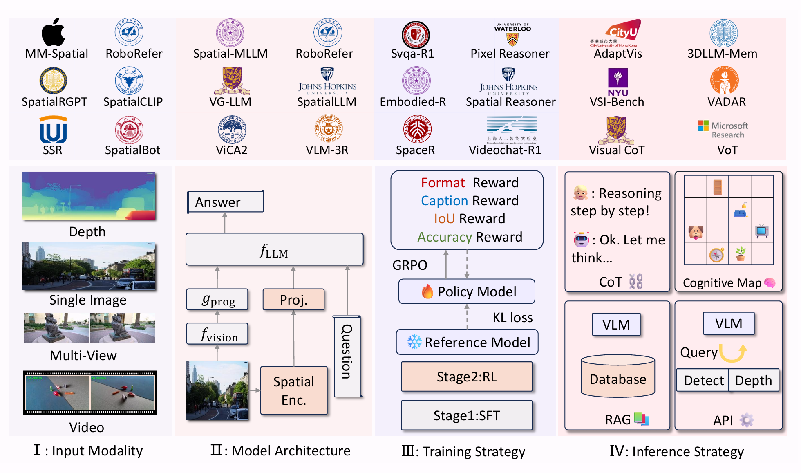   | 2025-09 |     [Github](https://sibench.github.io/Awesome-Visual-Spatial-Reasoning/)   |
|   [Has GPT-5 Achieved Spatial Intelligence? An Empirical Study](https://arxiv.org/pdf/2508.13142v1) |   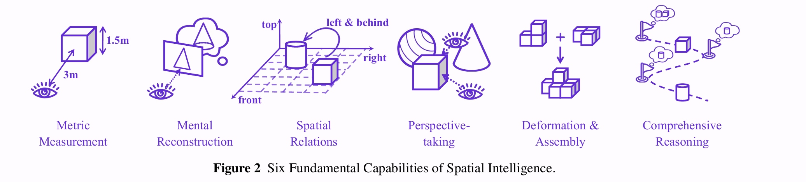   | 2025-08 |    -  |
|   [A Call for New Recipes to Enhance Spatial Reasoning in MLLMs](https://arxiv.org/pdf/2504.15037) |   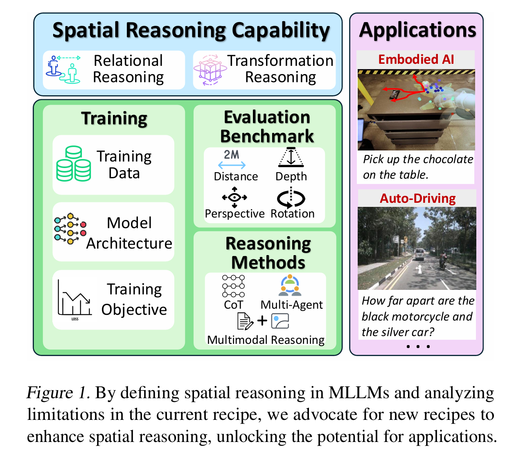   | 2025-03 |     [Github](https://aka.ms/GeneralAI)   |
|   [Why Is Spatial Reasoning Hard for VLMs? An Attention Mechanism Perspective on Focus Areas](https://arxiv.org/abs/2503.01773) |   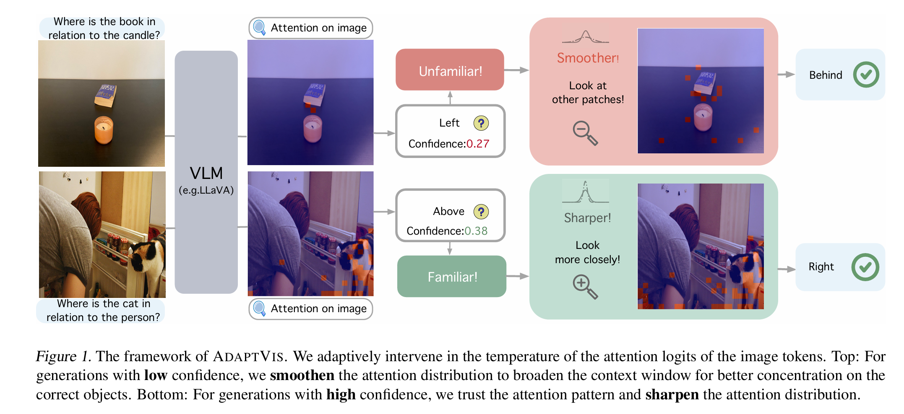   | 2025-03 |     [Github](https://github.com/shiqichen17/AdaptVis)   |
|   [Beyond Semantics: Rediscovering Spatial Awareness in Vision-Language Models](https://arxiv.org/abs/2503.17349) |   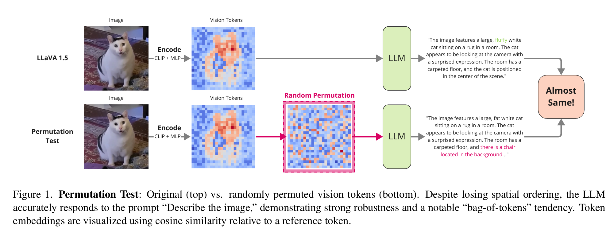   | 2025-03 |     [Github](https://user074.github.io/respatialaware/)   |

## Applications
| Title                                                        |                         Introduction                         |    Date    |                           Code                           |
| :----------------------------------------------------------- | :----------------------------------------------------------: | :--------: | :------------------------------------------------------: |
|   [Code-as-Monitor: Constraint-aware Visual Programming for Reactive and Proactive Robotic Failure Detection](https://arxiv.org/pdf/2412.04455) | 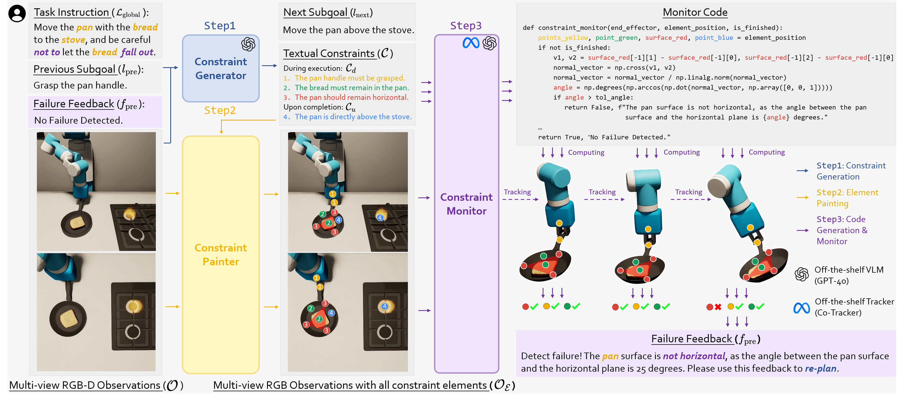 | 2024-12 | [Github](https://zhoues.github.io/Code-as-Monitor/) |
|   [SpatialPrompting: Keyframe-driven Zero-Shot Spatial Reasoning with Off-the-Shelf Multimodal Large Language Models](https://arxiv.org/pdf/2505.04911) |   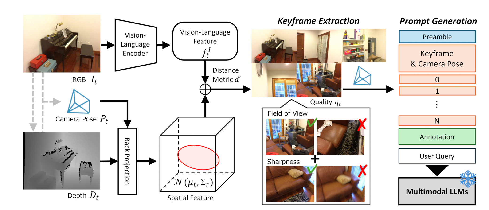   | 2025-05 |   - |
|   [InSpire: Vision-Language-Action Models with Intrinsic Spatial Reasoning](https://arxiv.org/pdf/2505.13888) |   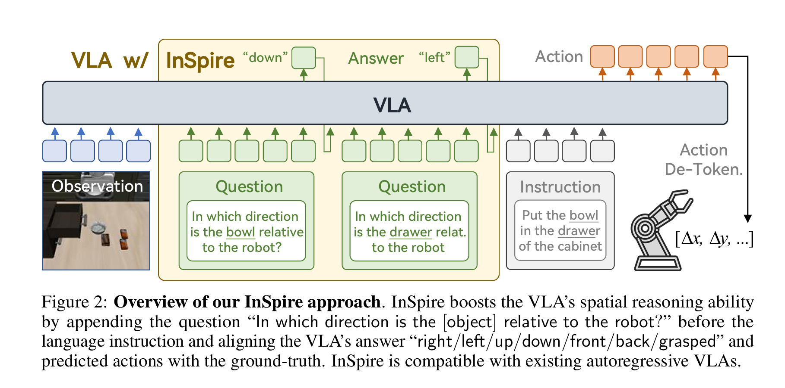   | 2025-05 |     [Github](https://koorye.github.io/proj/Inspire) |
|   [EmbodiedVSR: Dynamic Scene Graph-Guided Chain-of-Thought Reasoning for Visual Spatial Tasks](https://arxiv.org/pdf/2503.11089) |   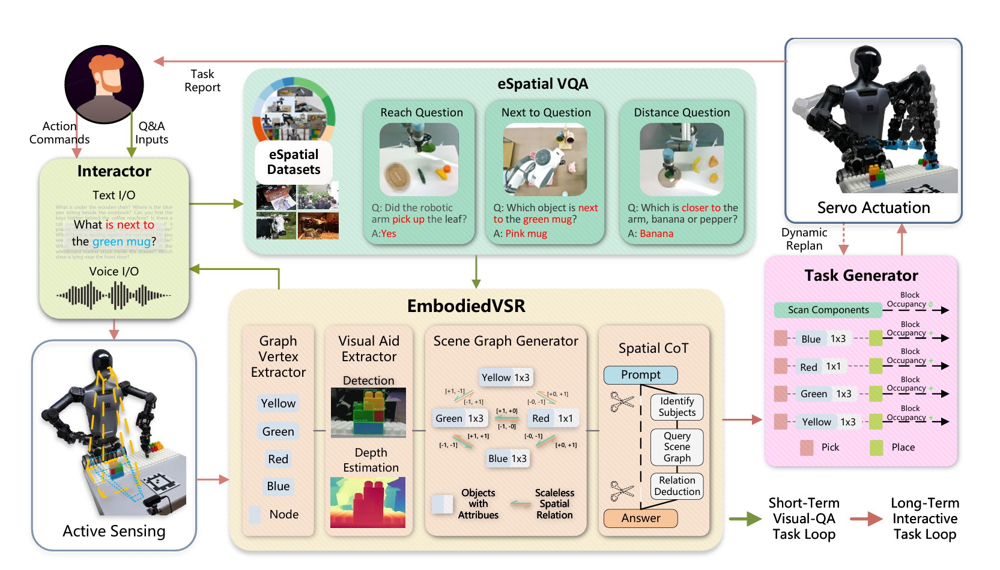   | 2025-03 |   - |
|   [SOFAR: Language-Grounded Orientation Bridges Spatial Reasoning and Object Manipulation](https://arxiv.org/pdf/2502.13143) |   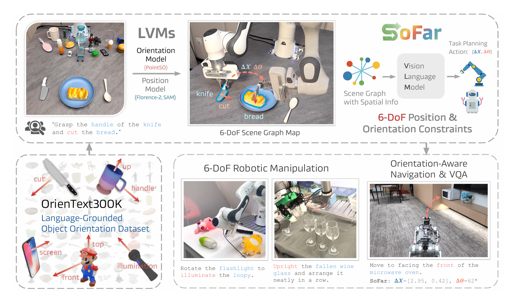   | 2025-02 |     [Github](https://qizekun.github.io/sofar) |
|   [ReasonGrounder: LVLM-Guided Hierarchical Feature Splatting for Open-Vocabulary 3D Visual Grounding and Reasoning](https://arxiv.org/abs/2503.23297) |   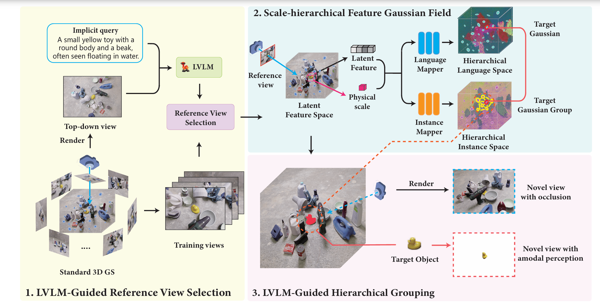   | 2025-03 |     [Github](https://zhenyangliu.github.io/ReasonGrounder/) |
|   [VL-Nav: Real-time Vision-Language Navigation with Spatial Reasoning](https://arxiv.org/abs/2502.0093) |      | 2025-02 |     -  |
|   [SpatialVLA: Exploring Spatial Representations for Visual-Language-Action Models](https://arxiv.org/abs/2501.15830) |      | 2025-01 |      [Github](https://github.com/SpatialVLA/SpatialVLA)  |
|   [EMMA-X:AnEmbodied Multimodal Action Model with Grounded Chain of Thought and Look-ahead Spatial Reasoning](https://arxiv.org/abs/2412.11974) |      | 2024-12 |      [Github](https://github.com/declare-lab/Emma-X)  |
|   [Know Your Neighbors: Improving Single-View Reconstruction via Spatial Vision-Language Reasoning](https://arxiv.org/abs/2404.03658) |      | 2024-04 |     [Github](https://github.com/ruili3/Know-Your-Neighbors)     |
|   [Improving Vision-and-Language Reasoning via Spatial Relations Modeling](https://arxiv.org/abs/2311.05298) |      | 2023-11 |    -     |
